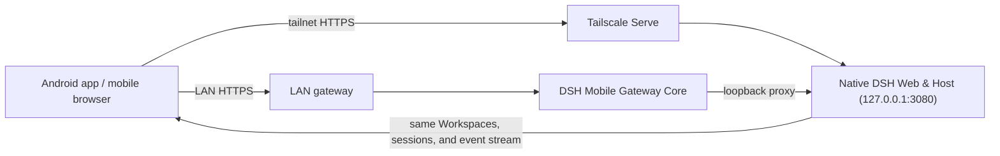

<p align="center">
  
</p>

<h1 align="center">dsh-mobile-tailscale</h1>

<p align="center">Secure, live access to DeepSeek Harness from a phone.</p>

<p align="center">
  <a href="https://github.com/qiushenjie/dsh-mobile-tailscale"></a>
  <a href="LICENSE"></a>
</p>

<p align="center"><a href="README.md">简体中文</a> · <a href="CHANGELOG.md">Changelog</a></p>

> dsh-mobile-tailscale is a fork of [dsh-mobile](https://github.com/saya-ch/dsh-mobile), a DeepSeek Harness community plugin; the native app supports Android only.
>
> **Difference from upstream**: the remote path no longer uses Tailscale Funnel, cpolar, or QR pairing. It uses **Tailscale Serve** instead — once the computer and phone sign in to the same tailnet, the phone browser opens the computer's MagicDNS name directly. No pairing, no manual certificate trust, no public exposure.
>
> LAN access is unchanged: QR / pairing-link / key pairing, device management, and auto-discovery all work as upstream.

dsh-mobile-tailscale is a DeepSeek Harness plugin that lets a mobile browser or the Android app connect over a protected LAN or a Tailscale Serve remote path. Local and remote access keep the same sessions, Workspaces, messages, and tools while using separate switches without modifying DeepSeek Harness source.

LAN mobile access runs on its own HTTPS origin with pinned certificates; only paired devices pass validation. Tailscale Serve remote access is visible only to devices on the same tailnet and has no pairing step.

It also lets you customize the phone from a DSH conversation: `/mobile <what you want>`.

## What it does

- **Continue DSH work from a phone**: the same sessions, Workspaces, messages, and tools, in real time.
- **Customize the phone UI by talking to DSH**: change the mobile layout, interactions, and features from a conversation; open pages refresh within seconds.
- **A dedicated touch layout**: session drawer, tool details, settings, question cards, and composer reorganized for phones.
- **LAN auto-discovery, no re-pairing**: Wi-Fi, hotspot, or IP changes normally recover automatically.
- **Direct Tailscale Serve remote**: any device on the same tailnet opens `https://<machine>.<tailnet>.ts.net` with no pairing or certificates.
- **One-click connection diagnostics**: check versions, gateway, network interface, firewall, and the remote path, then copy a report without credentials or full addresses.
- **Faster connection recovery**: remote reopen restores trust in parallel, reuses revisioned assets, and compresses mobile boot batches.
- **Three LAN pairing methods**: QR code, pairing link, and key.

Paired LAN devices are considered fully trusted and can operate DSH on the computer; use this only on trusted home, office, or VPN networks. For Tailscale remote access, the trust boundary is the tailnet itself.

## Quick start

With the `dsh` command installed:

```powershell
dsh plugin --profile web add dsh-mobile-tailscale@latest
dsh plugin --profile web exec dsh-mobile-tailscale setup
dsh --profile web
```

Using a DeepSeek Harness source checkout:

```powershell
corepack enable; pnpm install
pnpm dsh plugin --profile web add dsh-mobile-tailscale@latest
pnpm dsh plugin --profile web exec dsh-mobile-tailscale setup
pnpm dsh --profile web
```

`setup` automatically selects and remembers the current LAN; Wi-Fi, hotspot, and IP changes normally recover without re-pairing. Use `--address 192.168.x.x` only when automatic selection fails. Settings, certificates, devices, and customization files live under `$DSH_HOME/mobile-access/`.

After installation, start DSH and use the connection guide below to choose LAN or remote access.

## Connection guide

LAN and remote access are independent connections. Prefer LAN while the phone is near the computer for the lowest latency, and enable remote access only when leaving that network. Each path keeps its own switch and state.

### Local network

Use this when the phone and computer share Wi-Fi, Ethernet, or a phone hotspot. It is the default and simplest path.

<p align="center">
  
</p>

1. Connect the phone and computer to the same local network, then open **Mobile Access → Local network** in the lower-left corner of DeepSeek Harness.
2. If needed, select **Enable local access**, then select **Create and copy key**. The panel displays a pairing QR code.
3. In the Android app, open **Local network**, scan for computers, select the device, then scan the QR code or paste the pairing key.
4. Pairing creates persistent device trust. Later app launches discover and connect automatically; Wi-Fi, hotspot, and DHCP address changes normally do not require pairing again.

The app is optional: select **Copy pairing link** and open it in a mobile browser. The browser must manually trust the plugin certificate on the first visit.

### Remote access (Tailscale Serve)

Use this after the phone leaves the computer's network. No port forwarding, Funnel, or cpolar. Remote access is disabled by default.

**Prerequisites**: install [Tailscale](https://tailscale.com/download) on both the computer and the phone, and sign in to the same tailnet.

1. Open **Mobile Access → Remote** in the lower-left corner of DeepSeek Harness.
2. Select **Enable Tailscale Serve**. The plugin runs `tailscale serve --bg --https=443 http://127.0.0.1:3080` locally and uses the computer's MagicDNS name as the remote address.
3. Once ready, the panel shows an address like `https://<machine>.<tailnet>.ts.net`.
4. Open that address in a mobile browser (or the Android app's remote entry). Same-tailnet access works directly, with no pairing.

- Turn off the remote switch when not in use (the plugin runs `tailscale serve --https=443 off`).
- The remote origin is tailnet-only; it is never exposed to the public internet.
- If the address is unreachable, check that `tailscale status` shows online, that `tailscale serve status` lists the proxy, and that DSH Web listens on `127.0.0.1:3080`.
- DSH Desktop users must set the Web port to 3080 (`dsh-desktop.port: 3080`) and enable browser access so Tailscale Serve can forward correctly.

## Extend and customize

Type `/mobile <what you want>` in a DSH conversation, and DSH edits the phone client's files for you; changes apply within a few seconds. For example:

```text
/mobile turn the phone UI into an old CRT terminal, with messages scrolling like terminal output
```

It can also drive computer capabilities the phone can use, like reading the machine's live state:

```text
/mobile give the phone a cyberpunk-style computer monitor panel that shows live CPU, memory, and disk usage
```

Two kinds of changes are supported: the phone UI itself (theme, layout, buttons), and computer capabilities the phone can use (browsing computer files, running programs on the computer). `/mobile` hands the request to the DSH agent, which edits files under the local DSH configuration directory (`$DSH_HOME/mobile-access/`); the phone client applies them automatically. UI changes live in `mobile.css`/`mobile.js`. Computer capabilities come from extensions under `extensions/`, whose `host.mjs` runs with the local user's privileges on the computer. DeepSeek Harness source is not modified.

<sub>You can even use an extension to connect to SillyTavern running on the same computer, give it a lightweight mobile frontend, and open it from the same app.</sub>

> `host.mjs` has the same privileges as a local program. Create and run only computer-side extensions that you understand and trust.

The examples above, applied:

<p align="center">
  
  
  
  
</p>

## App vs mobile browser

| Method          | Best for                    | Notes                                                                      |
| --------------- | --------------------------- | -------------------------------------------------------------------------- |
| Android app     | Daily use                  | Home screen splits LAN and remote entries; LAN auto-discovers and pairs, remote opens the tailnet address |
| Mobile browser  | Temporary or cross-platform | Open the HTTPS address shown in the Mobile Access card; LAN needs one-time certificate trust, remote opens directly |

The Android app is a thin Kotlin WebView shell and does not bundle a second page; the mobile browser opens the same page. To troubleshoot compatibility, append `?frontend=stock` to the browser URL to temporarily return to the desktop page layout.

## How it works



The plugin has three layers: the Host face handles LAN discovery, pairing, HTTPS, loopback proxying, Tailscale Serve control, and the extension registry; the Client face provides the standalone mobile layout and extension SDK; the Android app provides a restricted native bridge. DeepSeek Harness source and the 3080 desktop page are never modified; installation and removal go entirely through the plugin mechanism.

## Security

- LAN listening is only for trusted home, office, or hotspot networks; do not set up port forwarding yourself.
- The Tailscale remote origin is visible only to the same tailnet; do not enable Tailscale Funnel or expose the node publicly. Turn off the remote switch when not in use.
- Paired LAN devices can operate DeepSeek Harness on the computer and should be treated as fully trusted; revoke the device from the computer if a phone is lost.
- The mobile gateway listens on the LAN only while enabled; after it is off, DeepSeek Harness keeps running normally on the computer.

See [SECURITY.md](SECURITY.md) for the full notes.

## Compatibility

| dsh-mobile-tailscale | Verified DeepSeek Harness                                                  |
| -------------------- | -------------------------------------------------------------------------- |
| `0.3.2`              | `0.1.0-rc.5`, `0.1.0-rc.6`, `0.1.0-rc.7`, `0.1.1-rc.2`, `0.1.2-alpha.1` |
| `0.3.1`              | `0.1.0-rc.5`, `0.1.0-rc.6`, `0.1.0-rc.7`, `0.1.1-rc.2`, `0.1.2-alpha.1` |

On startup the plugin checks the DSH Host version and the frontend dependencies required by the mobile layout; it errors out on unverified versions rather than starting broken. CI continuously tracks the DSH main branch layout contract. If you see a compatibility warning after upgrading DSH, upgrade dsh-mobile-tailscale first.

## Uninstall

```powershell
dsh plugin --profile web remove dsh-mobile-tailscale
```

Also remove plugin data:

```powershell
dsh plugin --profile web exec dsh-mobile-tailscale purge --yes
dsh plugin --profile web remove dsh-mobile-tailscale
```

In source-checkout mode, replace `dsh` with `pnpm dsh`.

## Development

```powershell
npm ci
npm run verify
```

For Android builds, see the [app docs](apps/mobile/README.zh-CN.md).

Apache-2.0, see [LICENSE](LICENSE).