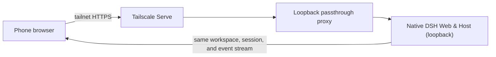

<p align="center">
  
</p>

<h1 align="center">dsh-mobile-tailscale</h1>

<p align="center">Use the DeepSeek Harness on your computer, securely, from your phone's browser.</p>

<p align="center">
  <a href="https://github.com/qiushenjie/dsh-mobile-tailscale"></a>
  <a href="LICENSE"></a>
</p>

<p align="center">
  <a href="#install">Install</a> ·
  <a href="#usage">Usage</a> ·
  <a href="#what-the-phone-side-does">What the phone side does</a> ·
  <a href="#customize">Customize</a> ·
  <a href="#configuration">Configuration</a> ·
  <a href="#troubleshooting">Troubleshooting</a> ·
  <a href="CHANGELOG.md">Changelog</a> ·
  <a href="README.md">中文</a>
</p>

> dsh-mobile-tailscale is a fork of [dsh-mobile](https://github.com/saya-ch/dsh-mobile), a DeepSeek Harness community plugin. Its remote path uses **Tailscale Serve** — no Funnel, no cpolar, and no QR pairing: once the computer and the phone sign in to the same tailnet, the phone browser opens the computer's node name directly.
>
> Since `0.6.0`, both the **Mobile Access** panel in the lower-left corner of the desktop and this document describe that one channel only: the panel has no app download, no LAN pairing QR code, no pairing key, and no device management.

## What this is

A DSH plugin. It hands the DSH Web client running on your computer to phones in the same tailnet over HTTPS via **Tailscale Serve**:

- Open `https://<computer-node>.<tailnet>.ts.net` in the phone browser and you are in — no app to install, no QR code to scan, no login page.
- Access control is tailnet membership itself, and the certificate is issued by Let's Encrypt, so there is no certificate warning.
- DSH's source is not modified: on the host side it adds only one loopback passthrough proxy, and on the client side it only injects phone-side interaction and layout fixes.


```mermaid
flowchart LR
  Phone["Phone browser"] -->|"tailnet HTTPS"| Serve["Tailscale Serve"]
  Serve --> Proxy["Loopback passthrough proxy"]
  Proxy --> DSH["Native DSH Web & Host (loopback)"]
  DSH -->|"same workspace, session, and event stream"| Phone
```

## Install

Requires Node `^22.19.0 || >=24.0.0`; install [Tailscale](https://tailscale.com/download) on both the phone and the computer and sign in to the same tailnet. This package is not published to npm yet (`npm view dsh-mobile-tailscale` returns 404), so install from source:

```bash
git clone https://github.com/qiushenjie/dsh-mobile-tailscale.git && cd dsh-mobile-tailscale
npm ci && npm run build && npm pack
dsh plugin --profile web add "$PWD/$(ls -1 dsh-mobile-tailscale-*.tgz | sort -V | tail -1)"
dsh --profile web
```

macOS's DSH Desktop does not add `dsh` to PATH. The simplest fix is a global CLI matching your Desktop version — `npm install -g @deepseek-ai/dsh@0.1.7-rc.2` — after which the commands above just use `dsh`.

Older builds unpacked the implementation inside the app bundle, so the bundled CLI also works there (the current app is `DeepSeek Harness.app`, whose implementation is packed into `Contents/Resources/app.asar`, so this path only exists on older versions):

```bash
DSH_APP="/Applications/DSH Desktop.app"   # older app name; the current one is /Applications/DeepSeek Harness.app
node "$DSH_APP/Contents/Resources/app/node_modules/@deepseek-ai/dsh/lib/bin.js" --version
```

- **The remote path does not need `dsh-mobile setup`**: the bundled `cordis.patch.yml` already points at the state file and the loopback listener, so you only flip the switch in the panel. (`dsh-mobile` is the CLI this plugin provides; it also has `purge` and `extension create` subcommands.)
- **Reinstalling the same version over the top has no effect** (pnpm only reports `added 0`): first `rm -rf $DSH_HOME/profiles/<profile>/node_modules/dsh-mobile-tailscale`, then `add`.
- **Host-side code is not hot-replaced**: after upgrading the plugin, fully quit and reopen DSH Desktop; client-side assets only need the phone page refreshed.

## Usage

1. In the lower-left corner of DSH, open the **Mobile Access** panel and click **Enable remote access**.
2. Once the panel shows `https://<computer-node>.<tailnet>.ts.net`, open it in the phone browser.
3. Click **Disable remote access** when you are done (the phone page disconnects immediately).

The panel has only one view: the remote address (**Copy address**), the enable/disable switch, one status line, **Reconnect**, and **Diagnostics** (which runs a redacted self-check). The switch, reconnect, and reset accept calls from the local computer only. Health check: `https://<computer-node>.<tailnet>.ts.net/mobile-access/health` returning `{"ok":true}` means the channel is healthy.

## What the phone side does

The phone opens the same session and event stream as the computer; the plugin does four things on the client side:

- **Reflow for touch**: the session drawer, tool details, the settings page, question cards, and the composer reflow on narrow screens; the right sidebar becomes a scrollable drawer on narrow screens instead of covering the conversation, and it scrolls normally inside.
- **Remove touch noise**: the composer font size is ≥16px (so iOS does not auto-zoom), press feedback applies only to real button/link rows, and terminal touch gestures switch to `pan-y`.
- **Make the phone keyboard actually type**: spaces and symbols reach the terminal instead of being dropped, and the first character is no longer repeated two or three times.
- **Speed up the remote channel**: long-lived caching of revisioned assets (navigation no longer re-downloads the whole shell), at most 20 messages in the session's first screen, older history paged in on demand, and desktop modules the phone cannot render pruned.

Details and troubleshooting steps are in [TROUBLESHOOTING.md](TROUBLESHOOTING.md).

## Customize

In a DSH conversation use `/mobile <request>`, and the agent edits the files under `$DSH_HOME/mobile-access/` directly; once saved, the changes take effect on the phone within seconds: for UI and interactions edit `mobile.css` / `mobile.js`; when you need computer capabilities use `extensions/`, whose `host.mjs` runs with your local privileges.

```text
/mobile turn the phone UI into an old-style terminal, with messages scrolling line by line like terminal output
/mobile add a cyberpunk-style monitor panel to the phone, showing live CPU, memory, and disk usage
```

To scaffold an extension by hand: `dsh plugin --profile web exec dsh-mobile extension create <id> [--name <name>]`.

<p align="center">
  
  
  
  
</p>

> `host.mjs` has the same privileges as a local program: create and run only extensions you understand and trust.

## Configuration

Keys go in the `mobile-access` entry of the profile's `cordis.patch.yml` (or the plugin manager's config panel); everything except `stateFile` may be omitted.

| Key | Default | Notes |
| --- | --- | --- |
| `stateFile` | required | The plugin's state file. The bundled `cordis.patch.yml` already sets it to `$DSH_HOME/mobile-access/devices.json`. |
| `upstreamOrigin` | `http://127.0.0.1:3080` | Loopback upstream; the remote proxy follows `DSH_WEB_URL` first, then falls back here. |
| `maxWebSockets` / `maxBodyBytes` / `upstreamTimeoutMs` | `64` / `160 MiB` / `30000` | The remote channel's concurrent WebSocket limit, request body limit, and upstream timeout. |

`customCssFile`, `customScriptFile`, and `mobileLayoutFile` are maintained by the plugin itself and normally need no hand-editing. The runtime files all live under `$DSH_HOME/mobile-access/`: `remote/control.json` (remote switch), `remote/provider.json` (provider), `mobile.css` / `mobile.js` (customization), `extensions/` (extensions).

## Troubleshooting

Start with [TROUBLESHOOTING.md](TROUBLESHOOTING.md) (which includes quick triage). The three most common cases:

- **The panel shows "ready" but the address will not open**: confirm both sides are online with `tailscale status`, click **Reconnect**, or check the Tailscale Serve 443 mapping as in [§4](TROUBLESHOOTING.md#4-远程通道显示-ready-但不可达).
- **The phone cannot open the address**: confirm Tailscale is running on the phone, that it is on the same tailnet as the computer, and that you opened the address the panel shows.
- **The phone layout looks wrong**: append `?frontend=stock` to the address to fall back to the native desktop page for a moment; while developing, `?dsh-mobile-preview` previews the phone layout in a desktop browser.

## Security

- Access control rests entirely on **tailnet membership**, so join only trusted devices to the tailnet.
- Do not enable Tailscale Funnel, and do not expose the node to the public internet; turn the remote switch off when not in use.
- The plugin listens on loopback only by default (`listenHost: 127.0.0.1`) and on no LAN port; the remote path needs no pairing and stores no pairing key or self-signed CA; the admin endpoints accept calls from the local computer only.

For the full threat model see [SECURITY.md](SECURITY.md).

## Compatibility

Verified against DSH `0.1.0-rc.5`, `0.1.0-rc.6`, `0.1.0-rc.7`, `0.1.1-rc.2`, `0.1.2-alpha.1`, `0.1.2-rc.1`, `0.1.7-rc.2`. An unlisted version only records one warning and continues starting up; a newer DSH may reject the whole plugin before loading it based on `peerDependencies`, in which case upgrade the plugin, or explicitly grant an exemption for that exact version combination.

## Uninstall

```bash
dsh plugin --profile web remove dsh-mobile-tailscale   # remove the plugin only
dsh plugin --profile web exec dsh-mobile purge --yes   # also clean up $DSH_HOME/mobile-access/
```

## Development

```bash
npm ci && npm run verify   # version check + type check + tests + build + pack dry run
```

## Origin and license

Apache-2.0, see [LICENSE](LICENSE) for details. The project is forked from [dsh-mobile](https://github.com/saya-ch/dsh-mobile); since 0.4.0 it keeps only the Tailscale Serve channel, and the host and client implementations have been rewritten. Since 0.6.0 the desktop panel and this document describe that channel only.
