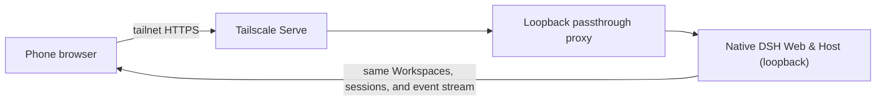

<p align="center">
  
</p>

<h1 align="center">dsh-mobile-tailscale</h1>

<p align="center">Secure, live access to DeepSeek Harness from a phone.</p>

<p align="center">
  <a href="https://github.com/qiushenjie/dsh-mobile-tailscale"></a>
  <a href="LICENSE"></a>
</p>

<p align="center">
  <a href="#what-it-does">What it does</a> ·
  <a href="#quick-start">Quick start</a> ·
  <a href="#connection-guide">Connection guide</a> ·
  <a href="#extend-and-customize">Extend and customize</a> ·
  <a href="#phone-experience">Phone experience</a> ·
  <a href="#configuration">Configuration</a> ·
  <a href="#troubleshooting">Troubleshooting</a> ·
  <a href="CHANGELOG.md">Changelog</a> ·
  <a href="README.md">简体中文</a>
</p>

> dsh-mobile-tailscale is a fork of [dsh-mobile](https://github.com/saya-ch/dsh-mobile), a DeepSeek Harness community plugin; it is used from a phone browser and needs no extra client.
>
> **Difference from upstream**: this plugin keeps exactly one connection path — **Tailscale Serve**. Once the computer and phone sign in to the same tailnet, the phone browser opens the computer's MagicDNS name directly. There is no QR pairing, no manual certificate trust, no public exposure, and no LAN listener at all.
>
> **As of 0.4.0 the local-network channel is gone entirely.** The former LAN HTTPS gateway, its `:3443` listener, pairing links and QR codes, paired-device management, the self-signed "DeepSeek Harness Mobile CA" chain, and the `dsh-mobile setup` subcommand no longer exist; `dsh-mobile setup` has no replacement because the remote path needs no initialization. See the [0.4.0 changelog](CHANGELOG.md#040) and the [troubleshooting guide](TROUBLESHOOTING.md#为什么不再有局域网直连) for why it was removed.

dsh-mobile-tailscale is a DeepSeek Harness plugin that lets a phone browser connect to the computer over Tailscale Serve, keeping the same sessions, Workspaces, messages, and tools, and never modifying DeepSeek Harness source.

Access control is tailnet membership itself: only devices signed in to the same tailnet and running Tailscale can see `https://<node>.<tailnet>.ts.net`, and that address carries a real Let's Encrypt certificate, so a phone meets no login page, no pairing step, and no certificate warning.

It also lets you customize the phone from a DSH conversation: `/mobile <what you want>`.

## What it does

- **Continue DSH work from a phone**: the same sessions, Workspaces, messages, and tools, in real time.
- **Customize the phone UI by talking to DSH**: change the mobile layout, interactions, and features from a conversation; open pages refresh within seconds.
- **A dedicated touch layout**: session drawer, tool details, settings, question cards, and composer reorganized for phones.
- **Direct Tailscale Serve remote**: any device on the same tailnet opens `https://<node>.<tailnet>.ts.net` with no pairing and no certificate trust.
- **One-click connection diagnostics**: check plugin/DSH version compatibility, the remote path, the Tailscale provider, and the phone network, then copy a report without credentials or full addresses.
- **Faster connection recovery**: remote reopen reuses revisioned assets and compresses mobile boot batches.

For Tailscale remote access, the trust boundary is the tailnet itself. Any device joined to that tailnet can operate DSH on the computer, so only join devices you trust.

## Quick start

> **Before you start**
>
> - The plugin's **package name** is `dsh-mobile-tailscale`; the **executable it ships** is `dsh-mobile` (subcommands such as `extension` and `purge` run through it, e.g. `dsh plugin --profile web exec dsh-mobile purge --yes`).
> - Installing via `dsh-mobile-tailscale@latest` requires the package to be published on npm (`npm view dsh-mobile-tailscale` shows a version). If it is not published yet (local fork / development), use "Option 3: Install from source" below.
> - **There is no initialization subcommand.** As of 0.4.0 `dsh-mobile setup` was removed together with the local-network channel; the remote path is enabled with the switch in the panel.

### Option 1: `dsh` command installed

**Windows (PowerShell)** — the DSH Desktop installer puts `dsh` on PATH:

```powershell
dsh plugin --profile web add dsh-mobile-tailscale@latest
dsh --profile web
```

**macOS (Terminal)** — DSH Desktop does **not** add `dsh` to PATH by default. Either:

1. Invoke the CLI bundled inside the Desktop app (the version in the path changes when Desktop is upgraded; verify with `--version`):

```bash
DSH_CLI="/Applications/DSH Desktop.app/Contents/Resources/app/node_modules/@deepseek-ai/dsh/lib/bin.js"
node "$DSH_CLI" --version
```

2. Or install globally the CLI matching the running Desktop (recommended):

```bash
npm install -g @deepseek-ai/dsh@<version>
```

Use the `--version` output from the previous step for `<version>` rather than pinning an old release; the plugin's peer range covers up to `0.1.7-rc.2`, so realign the same way after a Desktop upgrade.

Then run (`dsh` and `node "$DSH_CLI"` are equivalent):

```bash
dsh plugin --profile web add dsh-mobile-tailscale@latest
dsh --profile web
```

### Option 2: DeepSeek Harness source checkout

> Run these commands in the **DeepSeek Harness source repository root**, not in this plugin's directory — `dsh` is a workspace executable of the DSH monorepo, and only there does `pnpm dsh` resolve.

```bash
corepack enable; pnpm install
pnpm dsh plugin --profile web add dsh-mobile-tailscale@latest
pnpm dsh --profile web
```

The same commands work from a PowerShell prompt in the source root on Windows.

### Option 3: Install from source (no npm publish needed)

Use this when the plugin has not been published to npm yet (local fork / development). The full flow: **clone → install deps → build → pack → add to profile**.

**Prerequisites**: Node.js 22.19+ or 24+ (`package.json`'s `engines` is `^22.19.0 || >=24.0.0`; enable corepack to use pnpm).

**1. Clone and install dependencies:**

```bash
git clone https://github.com/qiushenjie/dsh-mobile-tailscale.git
cd dsh-mobile-tailscale
corepack enable
npm install        # or pnpm install
```

**2. Build and pack:**

```bash
npm run build
npm pack           # produces dsh-mobile-tailscale-<version>.tgz
```

> `npm pack` validates that `package.json`'s version matches `versionName` in `apps/mobile/android/app/build.gradle.kts`; align them first if they differ. Use `pnpm pack` if npm errors with EPERM on its cache, or `npm pack --ignore-scripts` to skip the validation and pack directly.

**3. Add the tarball to the web profile:**

**Windows (PowerShell):**

```powershell
dsh plugin --profile web add .\dsh-mobile-tailscale-<version>.tgz
dsh --profile web
```

**macOS (Terminal):**

```bash
# A directory may hold several historical tarballs: take the highest version, not head -1
TGZ=$(ls -1 dsh-mobile-tailscale-*.tgz | sort -V | tail -1)
dsh plugin --profile web add "$PWD/$TGZ"
dsh --profile web
```

(Use `<version>` as actually printed by `npm pack` / `pnpm pack` in the tarball filename; if the `dsh` command is unavailable, see Option 1 for the Desktop-bundled CLI.)

> **Reinstalling the same version does not take effect**: pnpm treats that version as already installed and skips it (printing `added 0`). Upgrading to a new version number can `add` directly; to reinstall the same version, delete the installed plugin directory first:
>
> ```bash
> rm -rf $DSH_HOME/profiles/<profile>/node_modules/dsh-mobile-tailscale
> ```
>
> Alternatively run `dsh plugin --profile web remove dsh-mobile-tailscale` and then `add`. Also note the plugin's host-side code is never hot-replaced: **you must fully quit and reopen DSH Desktop** for a change to take effect.

**Iterating during development**: after each source change, repeat steps 2–3 (`build` + `pack` + `add`) to overwrite the installed copy. If DSH Desktop is already running, fully quit and reopen it so the new plugin bundle loads.

After installation, start DSH, then install [Tailscale](https://tailscale.com/download) on both the computer and the phone and sign both into the same tailnet before enabling remote access in the next section. The plugin's state and customization files live under `$DSH_HOME/mobile-access/`.

## Connection guide

The remote path (Tailscale Serve) is the only supported connection as of 0.4.0. No port forwarding, no Funnel, no cpolar. Remote access is disabled by default.

**Prerequisites**: install [Tailscale](https://tailscale.com/download) on both the computer and the phone, and sign in to the **same tailnet**; Tailscale must be running on the phone.

1. Open the **Mobile Access** card in the lower-left corner of DeepSeek Harness. It has exactly one view: the remote address (with a copy action), an **Enable remote access**/**Disable remote access** switch, a status line, **Reconnect** and **Copy address**, and a **Diagnostics** section. There are no tabs, no QR code, and no device list.
2. Select **Enable remote access**. The plugin starts a loopback passthrough proxy locally and runs `tailscale serve --bg --yes --https=443 http://127.0.0.1:<remote proxy port>`, using the computer's MagicDNS name as the remote address. The registered target is the plugin's own loopback proxy port (dynamically assigned), not DSH's Web port; the proxy resolves the live upstream per request (`DSH_WEB_URL` first), so there is no need to pin DSH's Web port.
3. Once ready, the panel shows an address like `https://<node>.<tailnet>.ts.net`.
4. Open that address in the phone browser. Same-tailnet access works directly, with no pairing and no login. The certificate is issued by Let's Encrypt, so the browser does not stop on it.

- Turn off the remote switch when not in use (the plugin runs `tailscale serve --https=443 off` and stops the proxy).
- On shutdown it first reads `tailscale serve status --json` and clears the 443 entry only while it still points at this instance's own proxy; if that entry has moved to another process, the plugin stops only its own loopback proxy and leaves the other registration alone — so restarting Desktop no longer kills the ts.net channel.
- The remote origin is tailnet-only (`tailnet only`); it is never exposed to the public internet.
- If the state shows ready but `https://<node>.<tailnet>.ts.net` is unreachable: confirm `tailscale status` shows online, then re-run `tailscale serve --bg --yes --https=443 http://127.0.0.1:<remote proxy port>`, or just select **Reconnect** in the panel. Read `<remote proxy port>` from the `Proxy` field of `tailscale serve status --json`.
- The upstream automatically follows `DSH_WEB_URL` (falling back to the configured `upstreamOrigin`): DSH Desktop's Web port can change on each launch, and the plugin re-registers on start/reconnect, so there is nothing to point at manually.
- **Reset** (`POST /api/mobile-access/remote/reset`, body `{"confirm":true}`) clears the plugin's own remote state (the control and provider files under `$DSH_HOME/mobile-access/remote/`) to return the remote path to its initial state; it never tries to delete a 443 registration owned by another process. The endpoint accepts local callers only, and the panel carries no button for it.
- If port 443 is held by a leftover TCP forward, startup cleans it up automatically (only when 443 is the sole serve entry) and retries; a conflict with other entries surfaces as an explicit `serve_port_conflict` message in the panel.

**Local admin endpoints (computer-only)**: these accept only same-origin calls that satisfy the `sec-fetch-site` check; a non-local caller gets `403`:

| Endpoint | Purpose |
| --- | --- |
| `GET`/`POST` `/api/mobile-access/remote/control` | Read or toggle the remote switch (POST body `{"running":true}` or `{"running":false}`) |
| `POST` `/api/mobile-access/remote/reconnect` | Stop and restart the remote path, re-registering 443 |
| `POST` `/api/mobile-access/remote/reset` | Clear the plugin's own remote state |
| `GET` `/api/mobile-access/diagnostics` | Run a redacted diagnostic (remote path, Tailscale provider, and DSH version compatibility only) |

## Extend and customize

Type `/mobile <what you want>` in a DSH conversation, and DSH edits the phone client's files for you; changes apply within a few seconds. For example:

```text
/mobile turn the phone UI into an old CRT terminal, with messages scrolling like terminal output
```

It can also drive computer capabilities the phone can use, like reading the machine's live state:

```text
/mobile give the phone a cyberpunk-style computer monitor panel that shows live CPU, memory, and disk usage
```

Two kinds of changes are supported: the phone UI itself (theme, layout, buttons), and computer capabilities the phone can use (browsing computer files, running programs on the computer). `/mobile` hands the request to the DSH agent, which edits files under the local DSH configuration directory (`$DSH_HOME/mobile-access/`); the phone client applies them automatically. UI changes live in `mobile.css`/`mobile.js`. Computer capabilities come from extensions under `extensions/`, whose `host.mjs` runs with the local user's privileges on the computer. DeepSeek Harness source is not modified.

You can also scaffold an extension by hand:

```bash
dsh plugin --profile web exec dsh-mobile extension create <id> [--name <name>]
```

<sub>You can even use an extension to connect to SillyTavern running on the same computer, give it a lightweight mobile frontend, and open it from the same page.</sub>

> `host.mjs` has the same privileges as a local program. Create and run only computer-side extensions that you understand and trust.

The examples above, applied:

<p align="center">
  
  
  
  
</p>

## Phone browser

Open the `https://<node>.<tailnet>.ts.net` address shown in the Mobile Access card in a phone browser: same-tailnet access is direct, with no pairing and no certificate warning. To use DSH's own layout instead, set `mobileLayout` to `stock` (see [Configuration](#configuration)), or set it to `mobile` to force this plugin's dedicated mobile layout.

## How it works


```mermaid
flowchart LR
  Phone["Phone browser"] -->|"tailnet HTTPS"| Serve["Tailscale Serve"]
  Serve --> Proxy["Loopback passthrough proxy"]
  Proxy --> DSH["Native DSH Web & Host (loopback)"]
  DSH -->|"same Workspaces, sessions, and event stream"| Phone
```

The plugin has three layers: the Host face handles loopback passthrough proxying, Tailscale Serve control, and the extension registry; the Client face provides the standalone mobile layout and extension SDK. DeepSeek Harness source and the desktop page are never modified; installation and removal go entirely through the plugin mechanism.

## Phone experience

These releases (0.3.15–0.3.21) focus on what a phone pays to load and decode, and all of it now applies to the single remote channel:

- **Revisioned static assets cache for a long time** (0.3.15): content-addressed URLs (`/plugins/**?rev=…`, `/assets/**-<hash>.<ext>`) return `private, max-age=31536000, immutable`. Before this the remote channel stripped the cache headers and the phone re-downloaded about 5.66 MB on every navigation.
- **The phone's requested session window was narrowed** (0.3.16/0.3.18): DSH 0.1.7 streams a session's opening window over the `session/follow` WebSocket frame, and the phone originally asked for `maxMessages: 500`. The plugin rewrites that frame to `maxMessages: 10` and drops `turnWindow` (a Turn window is a floor, not a ceiling), taking a long session from about 291 records down to about 60.
- **Client modules a phone cannot render were pruned** (0.3.17): `dsh-desktop-next`, `dsh-better-sidebar`, `dsh-rewind-plugin`, and `@deepseek-ai/dsh-client-ui-settings-account` no longer enter the phone's boot batches.
- **A selectable layout strategy** (0.3.19): `mobileLayout: 'auto' | 'mobile' | 'stock'`, default `auto`; see [Configuration](#configuration).
- **Narrower pagination**: the opening session window is fixed at 10 messages; when scrolling for older history the remote channel pages 50 at a time (`REMOTE_HISTORY_PAGE_MESSAGES = 50`).

## Configuration

These keys live in the profile's plugin config (the `mobile-access` entry of `cordis.patch.yml`, or the plugin manager's config panel). All are optional unless noted; unset keys use the defaults.

| Key | Default | Notes |
| --- | --- | --- |
| `mobileLayout` | `auto` | Phone layout strategy: `auto` replaces only the layout generations this plugin implements, `mobile` also replaces the current generation, `stock` never replaces the layout. |
| `upstreamOrigin` | `http://127.0.0.1:3080` | Loopback upstream; the remote proxy follows `DSH_WEB_URL` first and falls back here. |
| `stateFile` | required | The plugin's own state file; the remote switch, the provider choice and `extensionsDir` are derived from its directory. The bundled `cordis.patch.yml` already sets it to `$DSH_HOME/mobile-access/state.json`, so you only set it when writing the plugin entry by hand. |
| `maxWebSockets` | `16` | Maximum WebSockets kept open on the remote channel. |
| `maxBodyBytes` | 160 MiB | Maximum size of a single request body. |
| `upstreamTimeoutMs` | `30000` | Forwarding timeout to the loopback upstream, in milliseconds. |

The following keys are `hidden` at the config layer and are maintained by the plugin; you normally do not write them by hand: `customCssFile`, `customScriptFile`, `mobileLayoutFile`, `mobileLayoutNextFile`. Together with `extensionsDir` (`<stateFile directory>/extensions`) they are derived from the directory of `stateFile`, so leave them at their defaults unless you are migrating data.

Where runtime state and customization files live:

| Path | Contents |
| --- | --- |
| `$DSH_HOME/mobile-access/remote/control.json` | Remote on/off state. |
| `$DSH_HOME/mobile-access/remote/provider.json` | Remote provider choice. |
| `$DSH_HOME/mobile-access/mobile.css`, `mobile.js` | Phone customization styles and scripts. |
| `$DSH_HOME/mobile-access/extensions/` | Extensions directory. |

> **0.4.0 removed the local-network configuration keys**: listen address/port, TLS certificate paths, `publicOrigin`/`publicAuthorities`, `allowedCidrs`, and the pairing/device policies (`pairingTtlMs`/`deviceTtlMs`/`maxDevices` and friends) are all gone. Leaving them in an old config is harmless but they are no longer read. The LAN-era `$DSH_HOME/mobile-access/control.json` is no longer read either.

## Troubleshooting

Start with [TROUBLESHOOTING.md](TROUBLESHOOTING.md) (Chinese). A few easy things to misread:

- **Restarting DSH Desktop no longer breaks the ts.net channel**: on shutdown the plugin clears the 443 entry only while it still points at this instance's own proxy (it compares against `tailscale serve status --json`); if that entry has moved to another process, the plugin stops only its own loopback proxy.
- **Remote shows ready but `https://<node>.<tailnet>.ts.net` is dead**: re-run `tailscale serve --bg --yes --https=443 http://127.0.0.1:<remote proxy port>`, or select **Reconnect** in the panel.
- **The phone cannot open the address**: first confirm Tailscale is installed and running on the phone and that both sides are on the same tailnet (`tailscale status` shows both online), then confirm the address is the MagicDNS name the panel shows.
- `GET /mobile-access/health` answers `{"ok":true}` on the remote path; if diagnostics still report the remote path unreachable, confirm the plugin is updated to 0.3.21+.

## Security

- Access control is **tailnet membership** alone: only devices signed in to the same tailnet can see `https://<node>.<tailnet>.ts.net`. Join only devices you trust.
- Do not enable Tailscale Funnel or expose the node publicly. Turn off the remote switch when not in use.
- The plugin no longer listens on any LAN port and no longer generates or stores pairing keys, device credentials, or a self-signed CA.
- The remote switch, reconnect, and reset admin endpoints accept calls from the computer itself only; a non-local caller gets `403`.
- After remote access is off, DeepSeek Harness keeps running normally on the computer.

See [SECURITY.md](SECURITY.md) for the full notes.

## Compatibility

| dsh-mobile-tailscale | Verified DeepSeek Harness                                                  |
| -------------------- | -------------------------------------------------------------------------- |
| `0.4.0` and later    | `0.1.0-rc.5`, `0.1.0-rc.6`, `0.1.0-rc.7`, `0.1.1-rc.2`, `0.1.2-alpha.1`, `0.1.2-rc.1`, `0.1.7-rc.2` |
| `0.3.7`–`0.3.21`     | same as above |
| `0.3.6`              | same as above |
| `0.3.5`, `0.3.4`, `0.3.3` | `0.1.0-rc.5`, `0.1.0-rc.6`, `0.1.0-rc.7`, `0.1.1-rc.2`, `0.1.2-alpha.1`, `0.1.2-rc.1` |
| `0.3.2`              | `0.1.0-rc.5`, `0.1.0-rc.6`, `0.1.0-rc.7`, `0.1.1-rc.2`, `0.1.2-alpha.1` |
| `0.3.1`              | `0.1.0-rc.5`, `0.1.0-rc.6`, `0.1.0-rc.7`, `0.1.1-rc.2`, `0.1.2-alpha.1` |

On startup the plugin compares the installed DSH Host version against the verified set above. **An unverified version only records a `DSH_MOBILE_UNVERIFIED_DSH_VERSION` warning and activation continues — it never aborts the Host**, because one plugin's version check must not stop the whole harness from booting. The frontend dependencies the mobile layout needs are still validated strictly where they are used, and fail closed there. CI continuously tracks the DSH main branch layout contract. If you see a compatibility warning after upgrading DSH, upgrade dsh-mobile-tailscale first. See the [troubleshooting guide](TROUBLESHOOTING.md) (Chinese) for diagnosis steps.

> **That advisory check is this plugin's own, and it does not override DSH's.** Newer DSH releases validate a plugin's declared `peerDependencies` against the runtime *before* loading, and **refuse to activate the whole plugin when they do not cover it** (log lines such as `Plugin … is incompatible with dsh …`, with an `Exact-version exemption` hint). The plugin is then absent from the tree entirely rather than running degraded. Upgrade dsh-mobile-tailscale, or grant the exact-version exemption for that specific combination in the plugin manager.

## Uninstall

```powershell
dsh plugin --profile web remove dsh-mobile-tailscale
```

Also remove plugin data:

```powershell
dsh plugin --profile web exec dsh-mobile purge --yes
dsh plugin --profile web remove dsh-mobile-tailscale
```

`purge` removes `$DSH_HOME/mobile-access/` (remote state, customization files, extensions). In source-checkout mode, run the same commands from the DSH source root with `pnpm dsh` instead of `dsh`; on macOS without the `dsh` command, use the Desktop-bundled CLI (see Quick start, Option 1).

## Development

```powershell
npm ci
npm run verify
```


Apache-2.0, see [LICENSE](LICENSE).
