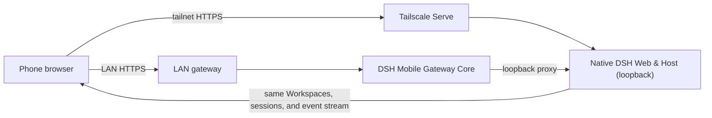

<p align="center">
  
</p>

<h1 align="center">dsh-mobile-tailscale</h1>

<p align="center">Secure, live access to DeepSeek Harness from a phone.</p>

<p align="center">
  <a href="https://github.com/qiushenjie/dsh-mobile-tailscale"></a>
  <a href="LICENSE"></a>
</p>

<p align="center">
  <a href="#what-it-does">What it does</a> ·
  <a href="#quick-start">Quick start</a> ·
  <a href="#connection-guide">Connection guide</a> ·
  <a href="#extend-and-customize">Extend and customize</a> ·
  <a href="#phone-experience">Phone experience</a> ·
  <a href="#configuration">Configuration</a> ·
  <a href="#troubleshooting">Troubleshooting</a> ·
  <a href="CHANGELOG.md">Changelog</a> ·
  <a href="README.md">简体中文</a>
</p>

> dsh-mobile-tailscale is a fork of [dsh-mobile](https://github.com/saya-ch/dsh-mobile), a DeepSeek Harness community plugin; it is used from a phone browser and needs no extra client.
>
> **Difference from upstream**: the remote path no longer uses Tailscale Funnel, cpolar, or QR pairing. It uses **Tailscale Serve** instead — once the computer and phone sign in to the same tailnet, the phone browser opens the computer's MagicDNS name directly. No pairing, no manual certificate trust, no public exposure.
>
> LAN access is still a standalone HTTPS gateway, but it is now entered through a one-time **pairing link**: the panel creates the link and the phone opens it to pair (see [Local network access and pairing](#local-network-access-and-pairing)). That one control is all the desktop panel keeps — it also renders the QR code for the same link — and the pairing key and paired-device management are gone from the panel.

dsh-mobile-tailscale is a DeepSeek Harness plugin that lets a phone browser connect over a protected LAN or a Tailscale Serve remote path. Both paths keep the same sessions, Workspaces, messages, and tools, switch on and off independently, and never modify DeepSeek Harness source.

LAN mobile access runs on its own HTTPS gateway with a self-managed certificate, and only paired devices get in. Tailscale Serve remote access is visible only to devices on the same tailnet and has no pairing step at all.

It also lets you customize the phone from a DSH conversation: `/mobile <what you want>`.

## What it does

- **Continue DSH work from a phone**: the same sessions, Workspaces, messages, and tools, in real time.
- **Customize the phone UI by talking to DSH**: change the mobile layout, interactions, and features from a conversation; open pages refresh within seconds.
- **A dedicated touch layout**: session drawer, tool details, settings, question cards, and composer reorganized for phones.
- **LAN discovery**: the plugin advertises a stable installation identifier on the machine (DNS-SD/mDNS plus periodic UDP announcements) so a scanning phone recognises the same computer.
- **Direct Tailscale Serve remote**: any device on the same tailnet opens `https://<host>.ts.net` with no pairing or certificates.
- **One-click connection diagnostics**: check versions, the LAN interface, the firewall, the LAN gateway, the remote path, and the phone network, then copy a report without credentials or full addresses.
- **Faster connection recovery**: remote reopen restores trust in parallel, reuses revisioned assets, and compresses mobile boot batches.
- **One-time pairing link**: the panel creates a link you send to the phone; opening it completes LAN pairing. The link is valid for two minutes and can be used once, and the panel shows its QR code for a phone camera to scan.

Paired LAN devices are considered fully trusted and can operate DSH on the computer; use this only on trusted home, office, or VPN networks. For Tailscale remote access, the trust boundary is the tailnet itself.

## Quick start

> **Before you start**
>
> - The plugin's **package name** is `dsh-mobile-tailscale`; the **executable it ships** is `dsh-mobile` (all subcommands such as `setup` run through it, e.g. `dsh plugin --profile web exec dsh-mobile setup`).
> - Installing via `dsh-mobile-tailscale@latest` requires the package to be published on npm (`npm view dsh-mobile-tailscale` shows a version). If it is not published yet (local fork / development), use "Option 3: Install from source" below.

### Option 1: `dsh` command installed

**Windows (PowerShell)** — the DSH Desktop installer puts `dsh` on PATH:

```powershell
dsh plugin --profile web add dsh-mobile-tailscale@latest
dsh plugin --profile web exec dsh-mobile setup
dsh --profile web
```

**macOS (Terminal)** — DSH Desktop does **not** add `dsh` to PATH by default. Either:

1. Invoke the CLI bundled inside the Desktop app (the version in the path changes when Desktop is upgraded; verify with `--version`):

```bash
DSH_CLI="/Applications/DSH Desktop.app/Contents/Resources/app/node_modules/@deepseek-ai/dsh/lib/bin.js"
node "$DSH_CLI" --version
```

2. Or install globally the CLI matching the running Desktop (recommended):

```bash
npm install -g @deepseek-ai/dsh@<version>
```

Use the `--version` output from the previous step for `<version>` rather than pinning an old release; the plugin's peer range covers up to `0.1.7-rc.2`, so realign the same way after a Desktop upgrade.

Then run (`dsh` and `node "$DSH_CLI"` are equivalent):

```bash
dsh plugin --profile web add dsh-mobile-tailscale@latest
dsh plugin --profile web exec dsh-mobile setup
dsh --profile web
```

### Option 2: DeepSeek Harness source checkout

> Run these commands in the **DeepSeek Harness source repository root**, not in this plugin's directory — `dsh` is a workspace executable of the DSH monorepo, and only there does `pnpm dsh` resolve.

```bash
corepack enable; pnpm install
pnpm dsh plugin --profile web add dsh-mobile-tailscale@latest
pnpm dsh plugin --profile web exec dsh-mobile setup
pnpm dsh --profile web
```

The same commands work from a PowerShell prompt in the source root on Windows.

### Option 3: Install from source (no npm publish needed)

Use this when the plugin has not been published to npm yet (local fork / development). The full flow: **clone → install deps → build → pack → add to profile → initialize**.

**Prerequisites**: Node.js 22.19+ or 24+ (`package.json`'s `engines` is `^22.19.0 || >=24.0.0`; enable corepack to use pnpm).

**1. Clone and install dependencies:**

```bash
git clone https://github.com/qiushenjie/dsh-mobile-tailscale.git
cd dsh-mobile-tailscale
corepack enable
npm install        # or pnpm install
```

**2. Build and pack:**

```bash
npm run build
npm pack           # produces dsh-mobile-tailscale-<version>.tgz
```

> `npm pack` validates that `package.json`'s version matches `versionName` in `apps/mobile/android/app/build.gradle.kts`; align them first if they differ. Use `pnpm pack` if npm errors with EPERM on its cache, or `npm pack --ignore-scripts` to skip the validation and pack directly.

**3. Add the tarball to the web profile and initialize:**

**Windows (PowerShell):**

```powershell
dsh plugin --profile web add .\dsh-mobile-tailscale-<version>.tgz
dsh plugin --profile web exec dsh-mobile setup
dsh --profile web
```

**macOS (Terminal):**

```bash
# A directory may hold several historical tarballs: take the highest version, not head -1
TGZ=$(ls -1 dsh-mobile-tailscale-*.tgz | sort -V | tail -1)
dsh plugin --profile web add "$PWD/$TGZ"
dsh plugin --profile web exec dsh-mobile setup
dsh --profile web
```

(Use `<version>` as actually printed by `npm pack` / `pnpm pack` in the tarball filename; if the `dsh` command is unavailable, see Option 1 for the Desktop-bundled CLI.)

> **Reinstalling the same version does not take effect**: pnpm treats that version as already installed and skips it (printing `added 0`). Upgrading to a new version number can `add` directly; to reinstall the same version, delete the installed plugin directory first:
>
> ```bash
> rm -rf $DSH_HOME/profiles/<profile>/node_modules/dsh-mobile-tailscale
> ```
>
> Alternatively run `dsh plugin --profile web remove dsh-mobile-tailscale` and then `add`. Also note the plugin's host-side code is never hot-replaced: **you must fully quit and reopen DSH Desktop** for a change to take effect.

**Iterating during development**: after each source change, repeat steps 2–3 (`build` + `pack` + `add`) to overwrite the installed copy. If DSH Desktop is already running, fully quit and reopen it so the new plugin bundle loads.

`setup` automatically selects and remembers the current LAN; Wi-Fi, hotspot, and IP changes normally recover without re-pairing. Use `--address 192.168.x.x` only when automatic selection fails. Settings, certificates, devices, and customization files live under `$DSH_HOME/mobile-access/`.

After installation, start DSH and use the connection guide below to choose LAN or remote access.

## Connection guide

LAN and remote access are independent connections. Prefer LAN while the phone is near the computer for the lowest latency, and enable remote access only when leaving that network. Each path switches on and off on its own without affecting the other.

### Local network access and pairing

Use this when the phone and computer share Wi-Fi, Ethernet, or a phone hotspot. It is the default and simplest path. The LAN gateway listens on `https://<lan-ip>:3443` with a self-managed self-signed certificate (under `$DSH_HOME/mobile-access/tls/`); `dsh-mobile setup` writes the network configuration to `$DSH_HOME/mobile-access/setup.json`, and the on/off state lives in `$DSH_HOME/mobile-access/control.json`.

**LAN requires pairing.** An unpaired device browsing to a page gets a `302` redirect to `/mobile-access/login?return=%2F`; the pairing page `GET /mobile-access/pair` exists only while a pairing window is open and otherwise returns `404`. Pairing is one-time and single-device: a window accepts exactly one pairing, and its lifetime is `pairingTtlMs` (default 120 s, minimum 10 s, maximum 600 s).

<p align="center">
  
</p>

How to pair:

1. Connect the phone and computer to the same local network, then open **Mobile Access → Local network** in the lower-left corner of DeepSeek Harness. The tab shows only `Browser access <address>`, one **Create pairing link** button, and a status line.
2. Select **Create pairing link**. The panel calls `POST /api/mobile-access/lan/pairing/open`, copies the returned `pairUrl` to the clipboard, and renders the QR code for the same link (`qrSvg`) below the button, shaped like:

   ```text
   https://<lan-ip>:3443/mobile-access/pair#instance=<instanceId>&token=<43-character token>
   ```

   The link is valid for two minutes and can be used once.
3. Send that link to the phone and open it (or scan the panel QR code with the phone camera). The phone completes pairing and gets a device credential; opening the link prefills the pairing code.
4. Pairing creates persistent device trust. Afterwards, just open the `Browser access` address the panel shows; Wi-Fi, hotspot, and DHCP address changes normally do not require pairing again.

The phone must be on the same network as the computer. The address the panel shows is **useless to an unpaired device** (it gets redirected to the login page) — which is exactly why the **Create pairing link** button exists. The app is optional: a mobile browser can complete the same flow. The browser must manually trust the plugin certificate on the first LAN visit.

**LAN switch and device management (local only)**: the desktop panel no longer offers a LAN switch, a pairing key/QR code, or paired-device management. Those operations now exist only behind loopback-only local admin endpoints, and must be called from the computer itself; a non-loopback caller gets `403`, and the phone is refused even when paired because the gateway rejects the whole `/api/mobile-access` prefix:

| Endpoint | Purpose |
| --- | --- |
| `GET`/`POST` `/api/mobile-access/lan/control` | Read or toggle the LAN switch (POST body `{"running":true}` or `{"running":false}`) |
| `POST` `/api/mobile-access/lan/pairing/open` | Open a pairing window; returns `pairUrl`, `appKey`, `qrSvg` (this is what the panel button calls) |
| `GET` `/api/mobile-access/lan/devices` | List paired devices |
| `POST` `/api/mobile-access/lan/devices/revoke` | Revoke one device (body `{"deviceId":"<32 hex chars>"}`) |
| `POST` `/api/mobile-access/lan/devices/reset` | Clear all devices (body `{"confirm":true}`) |

### Remote access (Tailscale Serve)

Use this after the phone leaves the computer's network. No port forwarding, Funnel, or cpolar. Remote access is disabled by default.

**Prerequisites**: install [Tailscale](https://tailscale.com/download) on both the computer and the phone, and sign in to the same tailnet.

1. Open **Mobile Access → Remote** in the lower-left corner of DeepSeek Harness. The tab shows the remote address, **Enable remote access**/**Disable remote access**, and **Reconnect**; there is no pairing and no QR code.
2. Select **Enable remote access**. The plugin starts a loopback passthrough proxy locally and runs `tailscale serve --bg --yes --https=443 http://127.0.0.1:<remote proxy port>`, using the computer's MagicDNS name as the remote address. The registered target is the plugin's own loopback proxy port (dynamically assigned), not DSH's Web port; the proxy resolves the live upstream per request (`DSH_WEB_URL` first), so there is no need to pin DSH's Web port.
3. Once ready, the panel shows an address like `https://<host>.ts.net`.
4. Open that address in the phone browser. Same-tailnet access works directly, with no pairing at all.

- Turn off the remote switch when not in use (the plugin runs `tailscale serve --https=443 off` and stops the proxy).
- On shutdown it first reads `tailscale serve status --json` and clears the 443 entry only while it still points at this instance's own proxy; if that entry has moved to another process, the plugin stops only its own loopback proxy and leaves the other registration alone — so restarting Desktop no longer kills the ts.net channel.
- The remote origin is tailnet-only (`tailnet only`); it is never exposed to the public internet.
- If the state shows ready but `https://<host>.ts.net` is unreachable: confirm `tailscale status` shows online, then re-run `tailscale serve --bg --yes --https=443 http://127.0.0.1:<remote proxy port>`, or just select **Reconnect** in the panel. Read `<remote proxy port>` from the `Proxy` field of `tailscale serve status --json`.
- The upstream automatically follows `DSH_WEB_URL` (falling back to the configured `upstreamOrigin`): DSH Desktop's Web port can change on each launch, and the plugin re-registers on start/reconnect, so there is nothing to point at manually.
- If port 443 is held by a leftover TCP forward, startup cleans it up automatically (only when 443 is the sole serve entry) and retries; a conflict with other entries surfaces as an explicit `serve_port_conflict` message in the panel.

## Extend and customize

Type `/mobile <what you want>` in a DSH conversation, and DSH edits the phone client's files for you; changes apply within a few seconds. For example:

```text
/mobile turn the phone UI into an old CRT terminal, with messages scrolling like terminal output
```

It can also drive computer capabilities the phone can use, like reading the machine's live state:

```text
/mobile give the phone a cyberpunk-style computer monitor panel that shows live CPU, memory, and disk usage
```

Two kinds of changes are supported: the phone UI itself (theme, layout, buttons), and computer capabilities the phone can use (browsing computer files, running programs on the computer). `/mobile` hands the request to the DSH agent, which edits files under the local DSH configuration directory (`$DSH_HOME/mobile-access/`); the phone client applies them automatically. UI changes live in `mobile.css`/`mobile.js`. Computer capabilities come from extensions under `extensions/`, whose `host.mjs` runs with the local user's privileges on the computer. DeepSeek Harness source is not modified.

<sub>You can even use an extension to connect to SillyTavern running on the same computer, give it a lightweight mobile frontend, and open it from the same app.</sub>

> `host.mjs` has the same privileges as a local program. Create and run only computer-side extensions that you understand and trust.

The examples above, applied:

<p align="center">
  
  
  
  
</p>

## Phone browser

Open the HTTPS address shown in the Mobile Access card in a phone browser: on the LAN, pair by opening the pairing link first and trust the certificate on the first visit; remotely, open the address from a device on the same tailnet. To troubleshoot compatibility, append `?frontend=stock` to the **LAN gateway page** URL to temporarily return to the desktop page layout; the flag works only on the LAN gateway (`https://<lan-ip>:3443/...`) and is not recognized by the remote `*.ts.net` path.

## How it works


```mermaid
flowchart LR
  Phone["Phone browser"] -->|"LAN HTTPS"| Lan["LAN gateway"]
  Phone -->|"tailnet HTTPS"| Serve["Tailscale Serve"]
  Lan --> Gateway["DSH Mobile Gateway Core"]
  Serve --> DSH["Native DSH Web & Host (loopback)"]
  Gateway -->|"loopback proxy"| DSH
  DSH -->|"same Workspaces, sessions, and event stream"| Phone
```

The plugin has three layers: the Host face handles LAN discovery, pairing, HTTPS, loopback proxying, Tailscale Serve control, and the extension registry; the Client face provides the standalone mobile layout and extension SDK. DeepSeek Harness source and the desktop page are never modified; installation and removal go entirely through the plugin mechanism.

## Phone experience

These releases (0.3.15–0.3.21) focus on what a phone pays to load and decode, regardless of which channel it uses:

- **Revisioned static assets cache for a long time** (0.3.15): content-addressed URLs (`/plugins/**?rev=…`, `/assets/**-<hash>.<ext>`) now return `private, max-age=31536000, immutable` on both channels. Before this the remote channel stripped the cache headers and the phone re-downloaded about 5.66 MB on every navigation.
- **The phone's requested session window was narrowed** (0.3.16/0.3.18): DSH 0.1.7 streams a session's opening window over the `session/follow` WebSocket frame, and the phone originally asked for `maxMessages: 500`. The plugin rewrites that frame to `maxMessages: 10` and drops `turnWindow` (a Turn window is a floor, not a ceiling), taking a long session from about 291 records down to about 60.
- **Client modules a phone cannot render were pruned** (0.3.17): `dsh-desktop-next`, `dsh-better-sidebar`, `dsh-rewind-plugin`, and `@deepseek-ai/dsh-client-ui-settings-account` no longer enter the phone's boot batches.
- **A selectable layout strategy** (0.3.19): `mobileLayout: 'auto' | 'mobile' | 'stock'`, default `auto`; see [Configuration](#configuration).
- **Narrower pagination**: the opening session window is fixed at 10 messages; when scrolling for older history the remote channel pages 50 at a time (`REMOTE_HISTORY_PAGE_MESSAGES = 50`) and the LAN channel pages 10 (`MOBILE_HISTORY_PAGE_MESSAGES = 10`).

## Configuration

These keys live in the profile's plugin config (the `mobile-access` entry of `cordis.patch.yml`, or the plugin manager's config panel). All are optional unless noted; unset keys use the defaults.

| Key | Default | Notes |
| --- | --- | --- |
| `mobileLayout` | `auto` | Phone layout strategy: `auto` replaces only the layout generations this plugin implements, `mobile` also replaces the current generation, `stock` never replaces the layout. |
| `listenHost` / `listenPort` | `127.0.0.1` / `3443` | LAN listen address and port. |
| `upstreamOrigin` | `http://127.0.0.1:3080` | Loopback upstream; the remote proxy follows `DSH_WEB_URL` first and falls back here. |
| `publicOrigin` | unset | Explicit public HTTPS origin (with port); mutually exclusive with `listenPort`/`publicAuthorities`. |
| `publicAuthorities` | derived from `listenHost` | Reachable host names/addresses; required for a non-loopback listener. |
| `allowedCidrs` | loopback ranges | Source networks allowed to reach the LAN gateway. |
| `tls.mode`/`certFile`/`keyFile`/`caFile` | `provided` (generated by `dsh-mobile setup`) | LAN gateway certificate; `disabled` is allowed only on a loopback listener. |
| `pairingTtlMs` | `120000` (10 s–600 s) | Pairing window lifetime. |
| `deviceTtlMs` | 90 days | Paired-device trust lifetime. |
| `sessionTtlMs` | 8 hours (must not exceed `deviceTtlMs`) | Post-pairing Web session lifetime. |
| `maxDevices` | `32` | Maximum retained paired devices. |
| `maxSessions`/`maxConnections`/`maxActiveRequests`/`maxWebSockets` | `64`/`64`/`32`/`16` | Concurrency limits. |
| `maxBodyBytes` | 160 MiB | Maximum request body. |
| `upstreamTimeoutMs` | `30000` | Upstream request timeout. |
| `rateLimitWindowMs`/`maxPairingAttempts`/`maxRateLimitKeys` | `60000`/`8`/`256` | Rate-limit window, pairing attempts per window, and rate-limit key cap. |

The following keys are `hidden` at the config layer and are maintained by the plugin or `dsh-mobile setup`; you normally do not write them by hand: `setupFile`, `controlFile`, `customCssFile`, `customScriptFile`, `mobileLayoutFile`, `mobileLayoutNextFile`, `instanceId`, `pairingCaFile`, `initiallyEnabled`. The data path `stateFile` (default `$DSH_HOME/mobile-access/devices.json`) and the `extensionsDir` derived from it (`<stateFile directory>/extensions`) are advanced too — leave them at their defaults unless you are migrating data.

`dsh-mobile setup` writes the LAN network configuration to `$DSH_HOME/mobile-access/setup.json` and the first-run on/off state to `$DSH_HOME/mobile-access/control.json`.

## Troubleshooting

Start with [TROUBLESHOOTING.md](TROUBLESHOOTING.md) (Chinese). Two easy things to misread:

- **Restarting DSH Desktop no longer breaks the ts.net channel**: on shutdown the plugin clears the 443 entry only while it still points at this instance's own proxy (it compares against `tailscale serve status --json`); if that entry has moved to another process, the plugin stops only its own loopback proxy.
- **Remote shows ready but `https://<host>.ts.net` is dead**: re-run `tailscale serve --bg --yes --https=443 http://127.0.0.1:<remote proxy port>`, or select **Reconnect** in the Remote tab.
- `GET /mobile-access/health` is now answered on **both** channels with `{"ok":true}`. The remote channel previously returned `404`, which made diagnostics falsely report the remote path unreachable; if diagnostics still say so, confirm the plugin has been updated.

## Security

- LAN listening is only for trusted home, office, or hotspot networks; do not set up port forwarding yourself.
- The Tailscale remote origin is visible only to the same tailnet; do not enable Tailscale Funnel or expose the node publicly. Turn off the remote switch when not in use.
- Paired LAN devices can operate DeepSeek Harness on the computer and should be treated as fully trusted; if a phone is lost, call `GET /api/mobile-access/lan/devices` on the computer to find its `deviceId`, then `POST /api/mobile-access/lan/devices/revoke` (body `{"deviceId":"<32 hex chars>"}`) to revoke it. These admin endpoints accept loopback callers only; a non-loopback caller gets `403`, and they are never exposed to the phone.
- The LAN switch and paired-device management exist only behind the loopback-only admin endpoints (see [Local network access and pairing](#local-network-access-and-pairing)); the phone is refused even when paired because the gateway rejects the whole `/api/mobile-access` prefix.
- The mobile gateway listens on the LAN only while enabled; after it is off, DeepSeek Harness keeps running normally on the computer.

See [SECURITY.md](SECURITY.md) for the full notes.

## Compatibility

| dsh-mobile-tailscale | Verified DeepSeek Harness                                                  |
| -------------------- | -------------------------------------------------------------------------- |
| `0.3.7` and later    | `0.1.0-rc.5`, `0.1.0-rc.6`, `0.1.0-rc.7`, `0.1.1-rc.2`, `0.1.2-alpha.1`, `0.1.2-rc.1`, `0.1.7-rc.2` |
| `0.3.6`              | same as above |
| `0.3.5`, `0.3.4`, `0.3.3` | `0.1.0-rc.5`, `0.1.0-rc.6`, `0.1.0-rc.7`, `0.1.1-rc.2`, `0.1.2-alpha.1`, `0.1.2-rc.1` |
| `0.3.2`              | `0.1.0-rc.5`, `0.1.0-rc.6`, `0.1.0-rc.7`, `0.1.1-rc.2`, `0.1.2-alpha.1` |
| `0.3.1`              | `0.1.0-rc.5`, `0.1.0-rc.6`, `0.1.0-rc.7`, `0.1.1-rc.2`, `0.1.2-alpha.1` |

On startup the plugin compares the installed DSH Host version against the verified set above. **An unverified version only records a `DSH_MOBILE_UNVERIFIED_DSH_VERSION` warning and activation continues — it never aborts the Host**, because one plugin's version check must not stop the whole harness from booting. The frontend dependencies the mobile layout needs are still validated strictly where they are used, and fail closed there. CI continuously tracks the DSH main branch layout contract. If you see a compatibility warning after upgrading DSH, upgrade dsh-mobile-tailscale first. See the [troubleshooting guide](TROUBLESHOOTING.md) (Chinese) for diagnosis steps.

> **That advisory check is this plugin's own, and it does not override DSH's.** Newer DSH releases validate a plugin's declared `peerDependencies` against the runtime *before* loading, and **refuse to activate the whole plugin when they do not cover it** (log lines such as `Plugin … is incompatible with dsh …`, with an `Exact-version exemption` hint). The plugin is then absent from the tree entirely rather than running degraded. Upgrade dsh-mobile-tailscale, or grant the exact-version exemption for that specific combination in the plugin manager.

## Uninstall

```powershell
dsh plugin --profile web remove dsh-mobile-tailscale
```

Also remove plugin data:

```powershell
dsh plugin --profile web exec dsh-mobile purge --yes
dsh plugin --profile web remove dsh-mobile-tailscale
```

In source-checkout mode, run the same commands from the DSH source root with `pnpm dsh` instead of `dsh`; on macOS without the `dsh` command, use the Desktop-bundled CLI (see Quick start, Option 1).

## Development

```powershell
npm ci
npm run verify
```


Apache-2.0, see [LICENSE](LICENSE).
