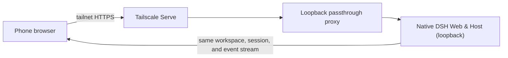

<p align="center">
  
</p>

<h1 align="center">dsh-mobile-tailscale</h1>

<p align="center">Use the DeepSeek Harness on your computer, securely, from your phone's browser.</p>

<p align="center">
  <a href="https://github.com/qiushenjie/dsh-mobile-tailscale"></a>
  <a href="LICENSE"></a>
</p>

<p align="center">
  <a href="#install">Install</a> ·
  <a href="#usage">Usage</a> ·
  <a href="#what-the-phone-side-does">What the phone side does</a> ·
  <a href="#customize">Customize</a> ·
  <a href="#configuration">Configuration</a> ·
  <a href="#troubleshooting">Troubleshooting</a> ·
  <a href="CHANGELOG.md">Changelog</a> ·
  <a href="README.md">中文</a>
</p>

## What this is

A DSH plugin. It hands the DSH Web client running on your computer to phones in the same tailnet over HTTPS via **Tailscale Serve**:

- Open `https://<computer-node>.<tailnet>.ts.net` in the phone browser and you are in — no app to install, no QR code to scan, no login page.
- Access control is tailnet membership itself, and the certificate is issued by Let's Encrypt, so there is no certificate warning.
- DSH's source is not modified: on the host side it adds only one loopback passthrough proxy, and on the client side it only injects phone-side interaction and layout fixes.


```mermaid
flowchart LR
  Phone["Phone browser"] -->|"tailnet HTTPS"| Serve["Tailscale Serve"]
  Serve --> Proxy["Loopback passthrough proxy"]
  Proxy --> DSH["Native DSH Web & Host (loopback)"]
  DSH -->|"same workspace, session, and event stream"| Phone
```

## Install

Requires Node `^22.19.0 || >=24.0.0`; install [Tailscale](https://tailscale.com/download) on both the phone and the computer and sign in to the same tailnet. This package is not published to npm yet, so install from source:

```bash
git clone https://github.com/qiushenjie/dsh-mobile-tailscale.git && cd dsh-mobile-tailscale
npm ci && npm run build && npm pack
dsh plugin --profile web add "$PWD/$(ls -1 dsh-mobile-tailscale-*.tgz | sort -V | tail -1)"
dsh --profile web
```

macOS's DSH Desktop does not add `dsh` to PATH, so use the bundled CLI instead (the path changes as Desktop is upgraded):

```bash
node "/Applications/DSH Desktop.app/Contents/Resources/app/node_modules/@deepseek-ai/dsh/lib/bin.js" \
     plugin --profile desktop add "<absolute path to the tgz>"
```

- **Reinstalling the same version over the top has no effect** (pnpm only reports `added 0`): first `rm -rf $DSH_HOME/profiles/<profile>/node_modules/dsh-mobile-tailscale`, then `add`.
- **Host-side code is not hot-replaced**: after upgrading the plugin, fully quit and reopen DSH Desktop; client-side assets only need the phone page refreshed.

## Usage

1. In the lower-left corner of DSH, open the **Mobile Access** panel and click **Enable remote access**.
2. Once the panel shows `https://<computer-node>.<tailnet>.ts.net`, open it in the phone browser.
3. Click **Disable remote access** when you are done (the phone page disconnects immediately).

The panel has only one view: the remote address (**Copy address**), the enable/disable switch, one status line, **Reconnect**, and **Diagnostics** (which runs a redacted self-check). The switch, reconnect, and reset accept calls from the local computer only; for the endpoint list see [troubleshooting guide §15](TROUBLESHOOTING.md#15-桌面面板与管理接口).

## What the phone side does

The phone opens the same session and event stream as the computer; the plugin only does three things:

- **Reflow for touch**: the session drawer, tool details, the settings page, question cards, and the composer reflow on narrow screens; the right sidebar becomes a scrollable drawer on narrow screens instead of covering the conversation.
- **Remove touch noise**: the composer font size is ≥16px (so iOS does not auto-zoom), press feedback applies only to real button/link rows, and terminal touch gestures switch to `pan-y`.
- **Speed up the remote channel**: long-lived caching of revisioned assets (navigation no longer re-downloads about 5.66 MB), the session's first screen loads only 10 messages, and desktop modules the phone cannot render are pruned. For details and measured data see [troubleshooting guide §13/§14](TROUBLESHOOTING.md#13-手机端卡顿与长会话载入慢).

## Customize

In a DSH conversation use `/mobile <request>`, and the agent edits the files under `$DSH_HOME/mobile-access/` directly; once saved, the changes take effect on the phone within seconds: for UI and interactions edit `mobile.css` / `mobile.js`; when you need computer capabilities use `extensions/`, whose `host.mjs` runs with your local privileges.

```text
/mobile turn the phone UI into an old-style terminal, with messages scrolling line by line like terminal output
/mobile add a cyberpunk-style monitor panel to the phone, showing live CPU, memory, and disk usage
```

To scaffold an extension by hand: `dsh plugin --profile web exec dsh-mobile extension create <id> [--name <name>]`.

> `host.mjs` has the same privileges as a local program: create and run only extensions you understand and trust.

## Configuration

Keys go in the `mobile-access` entry of the profile's `cordis.patch.yml` (or the plugin manager's config panel); everything except `stateFile` may be omitted.

| Key | Default | Notes |
| --- | --- | --- |
| `mobileLayout` | `auto` | Phone layout strategy: `auto` replaces only when this plugin supports that layout generation, `mobile` forces replacement, `stock` never replaces. |
| `upstreamOrigin` | `http://127.0.0.1:3080` | Loopback upstream; the remote proxy follows `DSH_WEB_URL` first, then falls back here. |
| `stateFile` | required | The plugin's state file. The bundled `cordis.patch.yml` already sets it to `$DSH_HOME/mobile-access/state.json`, and the extensions directory is derived from it. |
| `maxWebSockets` / `maxBodyBytes` / `upstreamTimeoutMs` | `64` / `160 MiB` / `30000` | The remote channel's concurrent WebSocket limit, request body limit, and upstream timeout. |

`customCssFile`, `customScriptFile`, `mobileLayoutFile`, and `mobileLayoutNextFile` are maintained by the plugin itself and normally need no hand-editing. The runtime files all live under `$DSH_HOME/mobile-access/`: `remote/control.json` (remote switch), `remote/provider.json` (provider), `mobile.css` / `mobile.js` (customization), `extensions/` (extensions).

## Troubleshooting

Start with [TROUBLESHOOTING.md](TROUBLESHOOTING.md) (which includes quick triage). The three most common cases:

- **The panel shows "ready" but the address will not open**: confirm both sides are online with `tailscale status`, click **Reconnect**, or re-register 443 as in [§4](TROUBLESHOOTING.md#4-远程通道显示-ready-但不可达).
- **The phone cannot open the address**: confirm Tailscale is running on the phone, that it is on the same tailnet as the computer, and that you opened the address the panel shows.
- **Health check**: `https://<computer-node>.<tailnet>.ts.net/mobile-access/health` returning `{"ok":true}` means the channel is healthy.

## Security

- Access control rests entirely on **tailnet membership**, so join only trusted devices to the tailnet.
- Do not enable Tailscale Funnel, and do not expose the node to the public internet; turn the remote switch off when not in use.
- The plugin listens on no LAN port and stores no pairing keys, device credentials, or self-signed CA; the admin endpoints accept calls from the local computer only.

For the full threat model see [SECURITY.md](SECURITY.md).

## Compatibility

Verified against DSH `0.1.0-rc.5`, `0.1.0-rc.6`, `0.1.0-rc.7`, `0.1.1-rc.2`, `0.1.2-alpha.1`, `0.1.2-rc.1`, `0.1.7-rc.2`. An unlisted version only records one warning and continues starting up; a newer DSH may reject the whole plugin before loading it based on `peerDependencies`, in which case upgrade the plugin, or explicitly grant an exemption for that exact version combination. For the historical table see [troubleshooting guide §19](TROUBLESHOOTING.md#19-诊断页与-dsh-版本兼容性).

## Uninstall

```bash
dsh plugin --profile web remove dsh-mobile-tailscale   # remove the plugin only
dsh plugin --profile web exec dsh-mobile purge --yes   # also clean up $DSH_HOME/mobile-access/
```

## Development

```bash
npm ci && npm run verify   # version check + type check + tests + build + pack dry run
```

## Origin and license

Apache-2.0, see [LICENSE](LICENSE) for details. The project is forked from [dsh-mobile](https://github.com/saya-ch/dsh-mobile); since 0.4.0 it keeps only the Tailscale Serve channel, and the host and client implementations have been rewritten.
