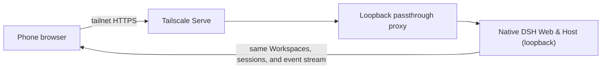

<p align="center">
  
</p>

<h1 align="center">dsh-mobile-tailscale</h1>

<p align="center">Use DeepSeek Harness on your computer from your phone, securely and in real time.</p>

<p align="center">
  <a href="https://github.com/qiushenjie/dsh-mobile-tailscale"></a>
  <a href="LICENSE"></a>
</p>

<p align="center">
  <a href="#quick-start">Quick start</a> ·
  <a href="#usage">Usage</a> ·
  <a href="#customize">Customize</a> ·
  <a href="#configuration">Configuration</a> ·
  <a href="#troubleshooting">Troubleshooting</a> ·
  <a href="CHANGELOG.md">Changelog</a> ·
  <a href="README.md">中文</a>
</p>

> This plugin is a fork of [dsh-mobile](https://github.com/saya-ch/dsh-mobile) that puts DeepSeek Harness's phone client on **Tailscale Serve**: open the computer node's MagicDNS address in the phone browser and you are in — no client to install, no DSH source changes.
>
> Access control is tailnet membership itself — only devices signed in to the same tailnet can see `https://<node>.<tailnet>.ts.net`, and the certificate is issued by Let's Encrypt, so there is no pairing, no login page, and no certificate warning.
>
> **As of 0.4.0 the local-network channel has been removed entirely**: the `:3443` listener, pairing links and QR codes, the self-signed CA, and `dsh-mobile setup` no longer exist. See the [0.4.0 changelog](CHANGELOG.md#040) for why.

## Quick start

The plugin's package name is `dsh-mobile-tailscale`; the executable it ships is `dsh-mobile`. **There is no initialization subcommand**: once installed, just flip the switch in the panel.

**Install from local source** (this package is not published on npm yet)

```bash
git clone https://github.com/qiushenjie/dsh-mobile-tailscale.git && cd dsh-mobile-tailscale
npm run build && npm pack                      # requires Node ^22.19.0 || >=24.0.0
dsh plugin --profile web add "$PWD/$(ls -1 dsh-mobile-tailscale-*.tgz | sort -V | tail -1)"
dsh --profile web
```

**Once it is published to npm**, that becomes:

```bash
dsh plugin --profile web add dsh-mobile-tailscale@latest
```

On macOS, DSH Desktop does not put `dsh` on PATH, so use the bundled CLI: `node "/Applications/DSH Desktop.app/Contents/Resources/app/node_modules/@deepseek-ai/dsh/lib/bin.js" plugin --profile web add …` (the version number in the path changes as Desktop is upgraded).

> - **Reinstalling the same version does nothing** (pnpm skips it and prints `added 0`): first `rm -rf $DSH_HOME/profiles/<profile>/node_modules/dsh-mobile-tailscale`, then `add`.
> - **Host-side code is not hot-replaced**: after changing the plugin, fully quit and reopen DSH Desktop; client assets only need a page refresh.
> - When working from the DSH repository root, use `pnpm dsh` instead of `dsh`.

## Usage

1. Install [Tailscale](https://tailscale.com/download) on both the computer and the phone, sign in to the **same tailnet**, and keep it running on the phone.
2. In the lower-left corner of DSH, open the **Mobile Access** panel and select **Enable remote access**.
3. Once the panel shows `https://<node>.<tailnet>.ts.net`, open it in the phone browser — no pairing, no login.
4. When you are done, select **Disable remote access**.

The panel holds only four things: the remote address (copyable), the switch, one status line, and **Diagnostics** (which runs a redacted self-check). The remote switch, reconnect, and reset accept calls from the computer itself only; for the endpoint list see [troubleshooting guide §15](TROUBLESHOOTING.md#15-桌面面板与管理接口).


```mermaid
flowchart LR
  Phone["Phone browser"] -->|"tailnet HTTPS"| Serve["Tailscale Serve"]
  Serve --> Proxy["Loopback passthrough proxy"]
  Proxy --> DSH["Native DSH Web & Host (loopback)"]
  DSH -->|"same Workspaces, sessions, and event stream"| Phone
```

## Customize

Use `/mobile <what you want>` in a DSH conversation, and the agent edits the files under `$DSH_HOME/mobile-access/` directly; once saved, the changes take effect on the phone within seconds: for UI and interactions edit `mobile.css` / `mobile.js`; when you need computer capabilities use `extensions/`, whose `host.mjs` runs with your local privileges.

```text
/mobile turn the phone UI into an old-style terminal, with messages scrolling line by line like terminal output
/mobile add a cyberpunk-style monitor panel to the phone, showing live CPU, memory, and disk usage
```

To scaffold an extension by hand: `dsh plugin --profile web exec dsh-mobile extension create <id> [--name <name>]`.

<p align="center">
  
  
  
  
</p>

> `host.mjs` has the same privileges as a local program: create and run only extensions you understand and trust.

## Configuration

Keys go in the `mobile-access` entry of the profile's `cordis.patch.yml` (or the plugin manager's config panel); everything except `stateFile` may be omitted.

| Key | Default | Notes |
| --- | --- | --- |
| `mobileLayout` | `auto` | Phone layout strategy: `auto` replaces only when this plugin supports that layout generation, `mobile` always replaces, `stock` never replaces. |
| `upstreamOrigin` | `http://127.0.0.1:3080` | Loopback upstream; the remote proxy follows `DSH_WEB_URL` first and falls back here. |
| `stateFile` | required | The plugin's state file. The bundled `cordis.patch.yml` already sets it to `$DSH_HOME/mobile-access/state.json`, and the extensions directory is derived from it. |
| `maxWebSockets` / `maxBodyBytes` / `upstreamTimeoutMs` | `64` / `160 MiB` / `30000` | The remote channel's concurrent WebSocket limit, request body limit, and upstream timeout. |

`customCssFile`, `customScriptFile`, `mobileLayoutFile`, and `mobileLayoutNextFile` are maintained by the plugin itself and normally need no hand-editing. The runtime files all live under `$DSH_HOME/mobile-access/`: `remote/control.json` (remote switch), `remote/provider.json` (provider), `mobile.css` / `mobile.js` (customization), `extensions/` (extensions).

## Phone experience

The phone client reflows the session drawer, tool details, settings, question cards, and composer for touch, and does three things on the remote channel: long-lived caching of revisioned assets (no more re-downloading about 5.66 MB on every navigation), narrowing the session's opening window to 10 messages, and pruning desktop modules the phone cannot render. For details and measured data see [troubleshooting guide §13/§14](TROUBLESHOOTING.md#13-手机端卡顿与长会话载入慢).

## Troubleshooting

Start with [TROUBLESHOOTING.md](TROUBLESHOOTING.md) (Chinese, includes quick triage). The three most common cases:

- **The panel shows "ready" but the address will not open**: confirm both sides are online with `tailscale status`, select **Reconnect**, or re-register 443 as in [§4](TROUBLESHOOTING.md#4-远程通道显示-ready-但不可达).
- **The phone cannot open the address**: confirm Tailscale is running on the phone, that it is on the same tailnet as the computer, and that you opened the address the panel shows.
- **Health check**: `https://<node>.<tailnet>.ts.net/mobile-access/health` returning `{"ok":true}` means the channel is healthy.

## Security

- Access control rests entirely on **tailnet membership**, so join only trusted devices to the tailnet.
- Do not enable Tailscale Funnel or expose the node to the public internet; turn the remote switch off when not in use.
- The plugin listens on no LAN port and stores no pairing keys, device credentials, or self-signed CA; the admin endpoints accept calls from the computer itself only.

For the full threat model see [SECURITY.md](SECURITY.md).

## Compatibility

`0.4.0` has been verified against `0.1.0-rc.5`, `0.1.0-rc.6`, `0.1.0-rc.7`, `0.1.1-rc.2`, `0.1.2-alpha.1`, `0.1.2-rc.1`, `0.1.7-rc.2`. An unverified DSH version only records one warning and continues starting up; but newer DSH releases reject the whole plugin before loading it based on `peerDependencies`, in which case upgrade the plugin, or explicitly grant an exemption for that exact version combination. For the historical table see [troubleshooting guide §19](TROUBLESHOOTING.md#19-诊断页与-dsh-版本兼容性).

## Uninstall

```bash
dsh plugin --profile web remove dsh-mobile-tailscale   # remove the plugin only
dsh plugin --profile web exec dsh-mobile purge --yes   # also clean up $DSH_HOME/mobile-access/
```

## Development

```bash
npm ci && npm run verify   # version check + type check + tests + build + pack dry run
```

Apache-2.0, see [LICENSE](LICENSE) for details.
