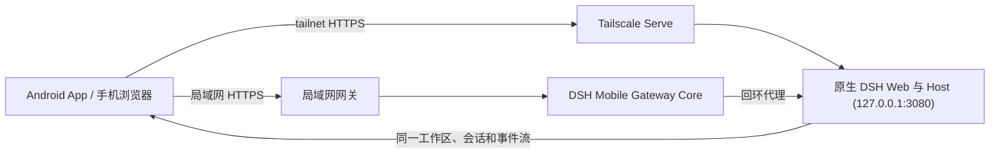

<p align="center">
  
</p>

<h1 align="center">dsh-mobile-tailscale</h1>

<p align="center">在手机上安全、实时地使用电脑中的 DeepSeek Harness。</p>

<p align="center">
  <a href="https://github.com/qiushenjie/dsh-mobile-tailscale"></a>
  <a href="LICENSE"></a>
</p>

<p align="center">
  <a href="#能做什么">能做什么</a> ·
  <a href="#快速开始">快速开始</a> ·
  <a href="#连接教程">连接教程</a> ·
  <a href="#扩展与自定义">扩展与自定义</a> ·
  <a href="TROUBLESHOOTING.md">排障</a> ·
  <a href="CHANGELOG.md">更新记录</a> ·
  <a href="README.en.md">English</a>
</p>

> dsh-mobile-tailscale 是 [dsh-mobile](https://github.com/saya-ch/dsh-mobile) 的 fork，一个 DeepSeek Harness 社区插件，原生 App 仅支持 Android。
>
> **与上游的区别**：远程连接不再使用 Tailscale Funnel / cpolar 与扫码配对机制，改为 **Tailscale Serve**——电脑与手机登录同一个 tailnet 后，手机浏览器直接打开电脑节点的 MagicDNS 地址即可，无需扫码配对、无需手动信任证书、无公网暴露。
>
> 局域网连接仍保留：二维码/配对链接/密钥配对、设备管理与自动发现均与上游一致。

dsh-mobile-tailscale 是一个 DeepSeek Harness 插件，让手机浏览器或 Android App 通过局域网，或 Tailscale Serve 远程通道连接电脑，继续使用同一份会话、工作区、消息和工具。局域网与远程访问分别启停、分别管理设备，且都不修改 DeepSeek Harness 源码。

局域网移动访问使用独立的 HTTPS 与证书固定，只有配对过的设备能通过校验接入；Tailscale Serve 远程访问只对同一 tailnet 内的设备可见，无配对步骤。

它还能在 DSH 对话里用 `/mobile <需求>` 定制手机端。

## 能做什么

- **在手机上继续电脑端的工作**：同一份会话、工作区、消息和工具，实时同步。
- **用对话定制手机端**：直接在 DSH 对话里改手机页面的布局、交互和功能，几秒内刷新。
- **专属触屏布局**：会话抽屉、工具详情、设置、提问卡片和输入栏都按手机重新组织。
- **局域网自动发现、无需重新配对**：切换 Wi-Fi、热点或 IP 后通常自动恢复。
- **Tailscale Serve 远程直连**：同 tailnet 的任意设备直接访问 `https://<机器名>.<tailnet>.ts.net`，无需配对与证书。
- **一键连接诊断**：检查版本、网关、网卡、防火墙和远程通道，并生成不含凭据与完整地址的脱敏报告。
- **更快恢复连接**：远程重开会并行恢复可信连接、复用版本化资源，并压缩移动端启动批次。
- **三种局域网配对方式**：扫码、配对链接、密钥。

局域网配对设备被视为完全信任，可以操作电脑上的 DSH；建议只在可信的家庭、办公局域网或可信 VPN 中使用。Tailscale 远程访问的可信边界是 tailnet 本身。

## 快速开始

> **安装前须知**
>
> - 插件的**包名**是 `dsh-mobile-tailscale`，它提供的**可执行命令**是 `dsh-mobile`（`setup`、`purge` 等子命令都通过它运行，例如 `dsh plugin --profile web exec dsh-mobile setup`）。
> - 使用 `dsh-mobile-tailscale@latest` 安装的前提是包已经发布到 npm（`npm view dsh-mobile-tailscale` 能查到版本）。尚未发布时（本地 fork / 开发阶段），请用下面的「方式三：从本地源码安装」。

### 方式一：使用 `dsh` 命令

**Windows（PowerShell）** —— DSH Desktop 安装后 `dsh` 已在 PATH：

```powershell
dsh plugin --profile web add dsh-mobile-tailscale@latest
dsh plugin --profile web exec dsh-mobile setup
dsh --profile web
```

**macOS（终端）** —— DSH Desktop 默认**不会**把 `dsh` 加入 PATH，需要二选一：

1. 全局安装与 Desktop 内置版本一致的 CLI（推荐）：

```bash
npm install -g @deepseek-ai/dsh@0.1.1-rc.2
```

2. 或直接调用 Desktop 内置的 CLI（路径里的版本号会随 Desktop 升级变化，先 `--version` 确认）：

```bash
DSH_CLI="/Applications/DSH Desktop.app/Contents/Resources/app/node_modules/@deepseek-ai/dsh/lib/bin.js"
node "$DSH_CLI" --version
```

然后执行（`dsh` 与 `node "$DSH_CLI"` 等价）：

```bash
dsh plugin --profile web add dsh-mobile-tailscale@latest
dsh plugin --profile web exec dsh-mobile setup
dsh --profile web
```

### 方式二：直接使用 DeepSeek Harness 源码

> 下面命令在 **DeepSeek Harness 源码仓库根目录** 执行（不是本插件目录）—— `dsh` 是 DSH monorepo 的 workspace 可执行文件，只有在那里 `pnpm dsh` 才能解析到。

```bash
corepack enable; pnpm install
pnpm dsh plugin --profile web add dsh-mobile-tailscale@latest
pnpm dsh plugin --profile web exec dsh-mobile setup
pnpm dsh --profile web
```

Windows 下在源码根目录的 PowerShell 里执行同样的命令即可。

### 方式三：从本地源码安装（无需发布 npm）

插件尚未发布到 npm 时（本地 fork / 开发阶段）使用。整体流程：**克隆 → 装依赖 → 构建 → 打包 → 装入 profile → 初始化**。

**前置条件**：Node.js 20+（建议开启 corepack 以使用 pnpm）。

**1. 获取源码并安装依赖：**

```bash
git clone https://github.com/qiushenjie/dsh-mobile-tailscale.git
cd dsh-mobile-tailscale
corepack enable
npm install        # 也可用 pnpm install
```

**2. 构建并打包：**

```bash
npm run build
npm pack           # 生成 dsh-mobile-tailscale-<version>.tgz
```

> `npm pack` 会校验 `package.json` 的 version 与 `apps/mobile/android/app/build.gradle.kts` 的 `versionName` 一致，不一致时先对齐再打包；npm 缓存报 EPERM 时改用 `pnpm pack`，只想跳过校验直接打包用 `npm pack --ignore-scripts`。

**3. 把 tarball 装入 web profile 并初始化：**

**Windows（PowerShell）：**

```powershell
dsh plugin --profile web add .\dsh-mobile-tailscale-0.3.5.tgz
dsh plugin --profile web exec dsh-mobile setup
dsh --profile web
```

**macOS（终端）：**

```bash
# 目录里可能留有多个历史 tarball：取版本号最大的那个，不要用 head -1
TGZ=$(ls -1 dsh-mobile-tailscale-*.tgz | sort -V | tail -1)
dsh plugin --profile web add "$PWD/$TGZ"
dsh plugin --profile web exec dsh-mobile setup
dsh --profile web
```

（tarball 文件名里的版本号以 `pnpm pack` 实际输出为准；`dsh` 命令不可用时参考方式一改用 Desktop 内置 CLI。）

> **覆盖安装同一版本不会生效**：pnpm 会认为该版本已安装而跳过。升级到新版本号可直接 `add`；需要重装同一版本时先 `dsh plugin --profile web remove dsh-mobile-tailscale`。

**开发迭代**：每次改动源码后，重新执行第 2、3 步（`build` + `pack` + `add`）覆盖安装即可。DSH Desktop 正在运行时，需要完全退出并重新打开才会加载新插件。

`setup` 会自动选择并记住当前局域网，切换 Wi-Fi、热点或 IP 后通常自动恢复；仅在自动选择失败时使用 `--address 192.168.x.x`。设置、证书、设备和自定义文件保存在 `$DSH_HOME/mobile-access/`。

安装并启动 DSH 后，按照下一节选择局域网或远程连接。

## 连接教程

局域网和远程访问是两套相互独立的连接：在电脑附近优先使用局域网，延迟最低；离开当前网络时再启用远程访问。两边分别管理开关和状态，互不影响。

### 局域网访问

适合同一 Wi-Fi、以太网或手机热点，是默认且最简单的连接方式。

<p align="center">
  
</p>

1. 让手机和电脑连接同一个局域网，在 DeepSeek Harness 左下角打开 **移动访问 → 局域网**。
2. 如果尚未开启，点击 **开启局域网访问**；随后点击 **生成并复制密钥**，面板会显示配对二维码。
3. 在 Android App 中进入 **局域网访问**，扫描发现电脑并点击设备，再扫描二维码或粘贴配对密钥。
4. 配对完成后会建立持久设备信任。以后打开 App 会自动发现并连接，切换 Wi-Fi、热点或 DHCP 地址通常不需要重新配对。

不安装 App 也可以访问：点击 **复制配对链接**，在手机浏览器中打开；首次访问需要按浏览器提示手动信任插件证书。

### 远程访问（Tailscale Serve）

适合手机离开电脑所在网络后使用。无需公网端口转发，也不使用 Funnel 或 cpolar；远程访问默认关闭。

**前提**：电脑和手机都安装 [Tailscale](https://tailscale.com/download)，并登录到同一个 tailnet。

1. 在 DeepSeek Harness 左下角打开 **移动访问 → 远程**。
2. 点击 **开启 Tailscale Serve**。插件会在本机启动一个回环直通代理，并执行 `tailscale serve --bg --https=443 http://127.0.0.1:<代理端口>`，把电脑的 MagicDNS 名作为远程地址。代理按请求解析实时上游（优先 `DSH_WEB_URL`），因此不需要固定 DSH 的 Web 端口。
3. 状态变为就绪后，面板会显示 `https://<机器名>.<tailnet>.ts.net` 这样的地址。
4. 在手机浏览器（或 Android App 的远程入口）打开该地址即可；同一 tailnet 内直接访问，无需扫码配对。

- 不使用时应关闭远程开关（插件会执行 `tailscale serve --https=443 off` 并停止代理）。
- 远程地址仅在 tailnet 内可见（`tailnet only`），不会被公开到公网。
- 若地址不可达，先确认 `tailscale status` 显示在线、`tailscale serve status` 中有对应代理记录。
- 上游自动跟随 `DSH_WEB_URL`（回退到配置的 `upstreamOrigin`）：DSH Desktop 每次启动端口随机，插件会在启动/重连时自动重新注册，无需手动重新指向。
- 443 端口若被残留的 TCP 转发占用，启动时会自动清理（仅当 443 是唯一的 serve 条目）并重试；与其他条目冲突时面板会显示明确的 `serve_port_conflict` 提示。

## 扩展与自定义

在 DSH 对话里输入 `/mobile <需求>`，DSH 会直接修改手机端的文件，几秒内生效。例如：

```text
/mobile 把手机端做成老式终端的样子，让消息像终端输出一样逐行滚动
```

也可以让手机端调用电脑端的能力，比如实时读取电脑状态：

```text
/mobile 为手机端添加赛博朋克风格的电脑监控面板，实时显示电脑的 CPU、内存和磁盘占用
```

`/mobile` 把需求交给 DSH 对话中的 agent，由它直接修改本机 `$DSH_HOME/mobile-access/` 下的文件，保存后手机端自动生效。改动分两类：界面和交互在 `mobile.css`/`mobile.js`；需要电脑能力时用 `extensions/` 下的扩展，其 `host.mjs` 以本机用户权限在电脑上运行。不修改 DeepSeek Harness 源码。

> `host.mjs` 与本机程序拥有相同权限；仅创建和运行你理解并信任的电脑端扩展。

示例的实际效果：

<p align="center">
  
  
  
  
</p>

## App 与手机浏览器

| 方式        | 适合场景         | 说明                                                                        |
| ------------- | ------------------ | ----------------------------------------------------------------------------- |
| Android App | 日常使用         | 首屏分开显示局域网与远程入口；局域网自动发现与配对，远程打开 tailnet 地址 |
| 手机浏览器  | 临时或跨平台访问 | 打开“移动访问”卡片显示的 HTTPS 地址；局域网首次访问需手动信任证书，远程直接打开 |

Android App 只是 Kotlin WebView 薄壳，不内置另一份网页；手机浏览器访问的是同一页面。需要排查兼容性时，可在浏览器地址后追加 `?frontend=stock`，临时回到旧的桌面页面适配模式。

## 工作原理



插件包含三层：Host face 负责局域网发现、配对、HTTPS、回环代理、Tailscale Serve 控制和扩展注册表；Client face 提供独立的移动布局与扩展 SDK；Android App 提供受限的原生 Bridge。DeepSeek Harness 的源码和 3080 桌面页面都不会被修改，安装和卸载完全通过插件机制完成。

## 安全

- 局域网监听只用于可信家庭、办公网络或可信热点；不要自行做端口转发。
- Tailscale 远程地址只对同一 tailnet 可见；不要开启 Tailscale Funnel 或把节点暴露到公网。不使用时应关闭远程开关。
- 局域网配对设备拥有控制电脑端 DeepSeek Harness 的能力，应视为完全可信设备；丢失手机后应在电脑端撤销设备。
- 移动网关开启时才监听局域网；关闭后 DeepSeek Harness 仍正常在电脑本机运行。

完整说明见 [SECURITY.md](SECURITY.md)。

## 兼容性

| dsh-mobile-tailscale | 已验证的 DeepSeek Harness                                               |
| -------------------- | ------------------------------------------------------------------------- |
| `0.3.5`、`0.3.4`、`0.3.3` | `0.1.0-rc.5`、`0.1.0-rc.6`、`0.1.0-rc.7`、`0.1.1-rc.2`、`0.1.2-alpha.1`、`0.1.2-rc.1` |
| `0.3.2`              | `0.1.0-rc.5`、`0.1.0-rc.6`、`0.1.0-rc.7`、`0.1.1-rc.2`、`0.1.2-alpha.1` |
| `0.3.1`              | `0.1.0-rc.5`、`0.1.0-rc.6`、`0.1.0-rc.7`、`0.1.1-rc.2`、`0.1.2-alpha.1` |

插件启动时会把当前 DSH Host 版本与上面的已验证集合比对：**未经验证的版本只记录一条 `DSH_MOBILE_UNVERIFIED_DSH_VERSION` 告警并继续启动，不会中断宿主**（一个插件的版本判断不应让整个 DSH 起不来）；移动布局所需的前端依赖则在使用处按契约严格校验，失败即拒绝。CI 也会持续跟踪 DSH 主分支的布局契约。升级 DSH 后如遇兼容提示，请先升级 dsh-mobile-tailscale。排查步骤见 [排障手册](TROUBLESHOOTING.md)。

## 卸载

```powershell
dsh plugin --profile web remove dsh-mobile-tailscale
```

同时清除插件数据：

```powershell
dsh plugin --profile web exec dsh-mobile purge --yes
dsh plugin --profile web remove dsh-mobile-tailscale
```

源码模式：在 DSH 源码根目录把 `dsh` 换成 `pnpm dsh`；macOS 未安装 `dsh` 命令时用 DSH Desktop 内置 CLI，见「快速开始」方式一。

## 开发

```powershell
npm ci
npm run verify
```

Android 构建见 [App 文档](apps/mobile/README.zh-CN.md)。

Apache-2.0，详见 [LICENSE](LICENSE)。