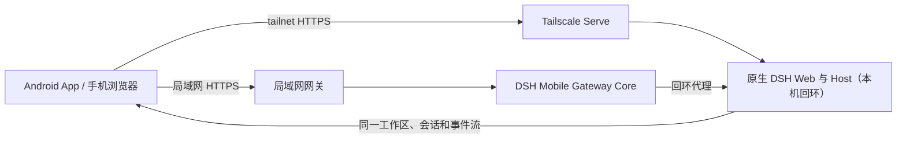

<p align="center">
  
</p>

<h1 align="center">dsh-mobile-tailscale</h1>

<p align="center">在手机上安全、实时地使用电脑中的 DeepSeek Harness。</p>

<p align="center">
  <a href="https://github.com/qiushenjie/dsh-mobile-tailscale"></a>
  <a href="LICENSE"></a>
</p>

<p align="center">
  <a href="#能做什么">能做什么</a> ·
  <a href="#快速开始">快速开始</a> ·
  <a href="#连接教程">连接教程</a> ·
  <a href="#扩展与自定义">扩展与自定义</a> ·
  <a href="#手机端体验">手机端体验</a> ·
  <a href="#配置项参考">配置</a> ·
  <a href="#排障">排障</a> ·
  <a href="CHANGELOG.md">更新记录</a> ·
  <a href="README.en.md">English</a>
</p>

> dsh-mobile-tailscale 是 [dsh-mobile](https://github.com/saya-ch/dsh-mobile) 的 fork，一个 DeepSeek Harness 社区插件，原生 App 仅支持 Android。
>
> **与上游的区别**：远程连接不再使用 Tailscale Funnel / cpolar 与扫码配对机制，改为 **Tailscale Serve**——电脑与手机登录同一个 tailnet 后，手机浏览器直接打开电脑节点的 MagicDNS 地址即可，无需扫码配对、无需手动信任证书、无公网暴露。
>
> 局域网仍是独立的 HTTPS 网关，改由一次性**配对链接**接入：面板生成链接，手机打开链接完成配对（见[局域网访问与配对](#局域网访问与配对)）。桌面面板只保留这一个入口（链接旁会显示同一个链接的配对二维码，供 Android App 扫码）；配对密钥与配对设备管理不再放在面板里。

dsh-mobile-tailscale 是一个 DeepSeek Harness 插件，让手机浏览器或 Android App 通过局域网，或 Tailscale Serve 远程通道连接电脑，继续使用同一份会话、工作区、消息和工具。两条通道相互独立、各自启停，且都不修改 DeepSeek Harness 源码。

局域网移动访问使用独立的 HTTPS 网关与自管理证书，只有配对过的设备能接入；Tailscale Serve 远程访问只对同一 tailnet 内的设备可见，完全没有配对步骤。

它还能在 DSH 对话里用 `/mobile <需求>` 定制手机端。

## 能做什么

- **在手机上继续电脑端的工作**：同一份会话、工作区、消息和工具，实时同步。
- **用对话定制手机端**：直接在 DSH 对话里改手机页面的布局、交互和功能，几秒内刷新。
- **专属触屏布局**：会话抽屉、工具详情、设置、提问卡片和输入栏都按手机重新组织。
- **局域网自动发现、无需反复配对**：电脑的局域网地址变化后，App 会按稳定的安装标识找回同一台电脑，通常自动恢复。
- **Tailscale Serve 远程直连**：同 tailnet 的任意设备直接访问 `https://<host>.ts.net`，无需配对与证书。
- **一键连接诊断**：检查版本、局域网网卡、防火墙、局域网网关、远程通道和手机网络，并生成不含凭据与完整地址的脱敏报告。
- **更快恢复连接**：远程重开会并行恢复可信连接、复用版本化资源，并压缩移动端启动批次。
- **一次性配对链接**：面板点「生成配对链接」，把链接发到手机打开即完成局域网配对；链接 2 分钟内有效且只能用一次。Android App 也可以直接扫面板同步显示的配对二维码。

局域网配对设备被视为完全信任，可以操作电脑上的 DSH；建议只在可信的家庭、办公局域网或可信 VPN 中使用。Tailscale 远程访问的可信边界是 tailnet 本身。

## 快速开始

> **安装前须知**
>
> - 插件的**包名**是 `dsh-mobile-tailscale`，它提供的**可执行命令**是 `dsh-mobile`（`setup`、`purge` 等子命令都通过它运行，例如 `dsh plugin --profile web exec dsh-mobile setup`）。
> - 使用 `dsh-mobile-tailscale@latest` 安装的前提是包已经发布到 npm（`npm view dsh-mobile-tailscale` 能查到版本）。尚未发布时（本地 fork / 开发阶段），请用下面的「方式三：从本地源码安装」。

### 方式一：使用 `dsh` 命令

**Windows（PowerShell）** —— DSH Desktop 安装后 `dsh` 已在 PATH：

```powershell
dsh plugin --profile web add dsh-mobile-tailscale@latest
dsh plugin --profile web exec dsh-mobile setup
dsh --profile web
```

**macOS（终端）** —— DSH Desktop 默认**不会**把 `dsh` 加入 PATH，需要二选一：

1. 直接调用 Desktop 内置的 CLI（路径里的版本号会随 Desktop 升级变化，先 `--version` 确认）：

```bash
DSH_CLI="/Applications/DSH Desktop.app/Contents/Resources/app/node_modules/@deepseek-ai/dsh/lib/bin.js"
node "$DSH_CLI" --version
```

2. 或全局安装与正在运行的 Desktop 一致的 CLI（推荐）：

```bash
npm install -g @deepseek-ai/dsh@<version>
```

`<version>` 用上一步 `--version` 的输出，而不是固定某个版本；插件的 peer 范围覆盖到 `0.1.7-rc.2`，Desktop 升级后按同样的方式对齐即可。

然后执行（`dsh` 与 `node "$DSH_CLI"` 等价）：

```bash
dsh plugin --profile web add dsh-mobile-tailscale@latest
dsh plugin --profile web exec dsh-mobile setup
dsh --profile web
```

### 方式二：直接使用 DeepSeek Harness 源码

> 下面命令在 **DeepSeek Harness 源码仓库根目录** 执行（不是本插件目录）—— `dsh` 是 DSH monorepo 的 workspace 可执行文件，只有在那里 `pnpm dsh` 才能解析到。

```bash
corepack enable; pnpm install
pnpm dsh plugin --profile web add dsh-mobile-tailscale@latest
pnpm dsh plugin --profile web exec dsh-mobile setup
pnpm dsh --profile web
```

Windows 下在源码根目录的 PowerShell 里执行同样的命令即可。

### 方式三：从本地源码安装（无需发布 npm）

插件尚未发布到 npm 时（本地 fork / 开发阶段）使用。整体流程：**克隆 → 装依赖 → 构建 → 打包 → 装入 profile → 初始化**。

**前置条件**：Node.js 22.19+ 或 24+（`package.json` 的 `engines` 为 `^22.19.0 || >=24.0.0`；建议开启 corepack 以使用 pnpm）。

**1. 获取源码并安装依赖：**

```bash
git clone https://github.com/qiushenjie/dsh-mobile-tailscale.git
cd dsh-mobile-tailscale
corepack enable
npm install        # 也可用 pnpm install
```

**2. 构建并打包：**

```bash
npm run build
npm pack           # 生成 dsh-mobile-tailscale-<version>.tgz
```

> `npm pack` 会校验 `package.json` 的 version 与 `apps/mobile/android/app/build.gradle.kts` 的 `versionName` 一致，不一致时先对齐再打包；npm 缓存报 EPERM 时改用 `pnpm pack`，只想跳过校验直接打包用 `npm pack --ignore-scripts`。

**3. 把 tarball 装入 web profile 并初始化：**

**Windows（PowerShell）：**

```powershell
dsh plugin --profile web add .\dsh-mobile-tailscale-<version>.tgz
dsh plugin --profile web exec dsh-mobile setup
dsh --profile web
```

**macOS（终端）：**

```bash
# 目录里可能留有多个历史 tarball：取版本号最大的那个，不要用 head -1
TGZ=$(ls -1 dsh-mobile-tailscale-*.tgz | sort -V | tail -1)
dsh plugin --profile web add "$PWD/$TGZ"
dsh plugin --profile web exec dsh-mobile setup
dsh --profile web
```

（tarball 文件名里的 `<version>` 以 `npm pack` / `pnpm pack` 实际输出为准；`dsh` 命令不可用时参考方式一改用 Desktop 内置 CLI。）

> **覆盖安装同一版本不会生效**：pnpm 会认为该版本已安装而跳过（输出 `added 0`）。升级到新版本号可直接 `add`；需要重装同一版本时，先删掉 profile 里的插件目录再 `add`：
>
> ```bash
> rm -rf $DSH_HOME/profiles/<profile>/node_modules/dsh-mobile-tailscale
> ```
>
> 也可以改用 `dsh plugin --profile web remove dsh-mobile-tailscale` 再 `add`。另外，插件的主机端代码不会热替换：**改动生效后必须完全退出并重新打开 DSH Desktop**。

**开发迭代**：每次改动源码后，重新执行第 2、3 步（`build` + `pack` + `add`）覆盖安装即可。DSH Desktop 正在运行时，需要完全退出并重新打开才会加载新插件。

`setup` 会自动选择并记住当前局域网，切换 Wi-Fi、热点或 IP 后通常自动恢复；仅在自动选择失败时使用 `--address 192.168.x.x`。设置、证书、设备和自定义文件保存在 `$DSH_HOME/mobile-access/`。

安装并启动 DSH 后，按照下一节选择局域网或远程连接。

## 连接教程

局域网和远程访问是两套相互独立的连接：在电脑附近优先使用局域网，延迟最低；离开当前网络时再启用远程访问。两条通道各自启停，互不影响。

### 局域网访问与配对

适合同一 Wi-Fi、以太网或手机热点，是默认且最简单的连接方式。局域网网关监听 `https://<lan-ip>:3443`，使用自管理的自签名证书（位于 `$DSH_HOME/mobile-access/tls/`）；网络配置由 `dsh-mobile setup` 写进 `$DSH_HOME/mobile-access/setup.json`，开关状态在 `$DSH_HOME/mobile-access/control.json`。

**局域网需要配对。** 未配对的设备用浏览器访问页面会得到 `302`，跳转到 `/mobile-access/login?return=%2F`；配对页 `GET /mobile-access/pair` 只在配对窗口打开时存在，否则返回 `404`。配对是一次性的、单设备：一个窗口只接受一次配对，窗口时长由 `pairingTtlMs` 决定（默认 120 秒，最小 10 秒，最大 600 秒）。

<p align="center">
  
</p>

配对步骤：

1. 让手机和电脑连接同一个局域网，在 DeepSeek Harness 左下角打开 **移动访问 → 局域网**。该标签页只显示 `浏览器访问 <地址>`、一个 **生成配对链接** 按钮和一行状态。
2. 点 **生成配对链接**。面板调用 `POST /api/mobile-access/lan/pairing/open`，把返回的 `pairUrl` 复制到剪贴板，并把同一链接的二维码（响应里的 `qrSvg`）显示在按钮下方，形如：

   ```text
   https://<lan-ip>:3443/mobile-access/pair#instance=<instanceId>&token=<43 位 token>
   ```

   链接 2 分钟内有效，且只能用一次。
3. 把这个链接发到手机并打开（Android App 也可以直接扫面板上的二维码）。手机会完成配对并获得设备凭据；App 打开该链接时配对码会自动填入。
4. 配对完成后即建立持久设备信任。之后打开面板显示的那个 `浏览器访问` 地址即可；切换 Wi-Fi、热点或 DHCP 地址后通常无需重新配对。

手机必须和电脑在同一网络。面板显示的地址对**未配对**的设备不可用（会被跳转到登录页）——这正是「生成配对链接」按钮存在的唯一原因。不安装 App 也可以用手机浏览器完成同样的流程；局域网首次访问需要按浏览器提示信任插件的自签名证书。

**局域网开关与设备管理（仅本机）**：桌面面板不再提供局域网开关、配对密钥/二维码和配对设备管理。这些操作只在仅回环（loopback-only）的本地管理接口上提供，必须从电脑本机调用；非本机来源返回 `403`，手机（即使已配对）访问 `/api/mobile-access` 前缀也会被网关直接拒绝：

| 接口 | 作用 |
| --- | --- |
| `GET`/`POST` `/api/mobile-access/lan/control` | 查看/切换局域网开关（POST body `{"running":true}` 或 `{"running":false}`） |
| `POST` `/api/mobile-access/lan/pairing/open` | 打开配对窗口并返回 `pairUrl`、`appKey`、`qrSvg`（面板按钮调用的就是它） |
| `GET` `/api/mobile-access/lan/devices` | 列出已配对设备 |
| `POST` `/api/mobile-access/lan/devices/revoke` | 撤销单个设备（body `{"deviceId":"<32 位 hex>"}`） |
| `POST` `/api/mobile-access/lan/devices/reset` | 清除全部设备（body `{"confirm":true}`） |

### 远程访问（Tailscale Serve）

适合手机离开电脑所在网络后使用。无需公网端口转发，也不使用 Funnel 或 cpolar；远程访问默认关闭。

**前提**：电脑和手机都安装 [Tailscale](https://tailscale.com/download)，并登录到同一个 tailnet。

1. 在 DeepSeek Harness 左下角打开 **移动访问 → 远程**。该标签页显示远程地址、**启用远程访问/关闭远程访问** 和 **重新连接**，没有配对与二维码。
2. 点 **启用远程访问**。插件会在本机启动一个回环直通代理，并执行 `tailscale serve --bg --yes --https=443 http://127.0.0.1:<远程代理端口>`，把电脑的 MagicDNS 名作为远程地址。注册目标是插件自己的回环代理端口（动态分配），不是 DSH 的 Web 端口；代理按请求解析实时上游（优先 `DSH_WEB_URL`），因此不需要固定 DSH 的 Web 端口。
3. 状态变为就绪后，面板会显示 `https://<host>.ts.net` 这样的地址。
4. 在手机浏览器（或 Android App 的远程入口）打开该地址即可；同一 tailnet 内直接访问，无需任何配对。

- 不使用时应关闭远程开关（插件执行 `tailscale serve --https=443 off` 并停止代理）。
- 关闭时会先读 `tailscale serve status --json`，只清除**仍指向本实例自己代理**的 443 条目；如果该条目已指向别的进程，插件只停自己的回环代理，不会动别人的注册——所以重启 Desktop 不会再打断 ts.net 通道。
- 远程地址仅在 tailnet 内可见（`tailnet only`），不会被公开到公网。
- 若状态已就绪但 `https://<host>.ts.net` 打不开：先确认 `tailscale status` 显示在线，然后重跑 `tailscale serve --bg --yes --https=443 http://127.0.0.1:<远程代理端口>`，或直接点面板上的 **重新连接**。`<远程代理端口>` 可从 `tailscale serve status --json` 的 `Proxy` 字段读出。
- 上游自动跟随 `DSH_WEB_URL`（回退到配置的 `upstreamOrigin`）：DSH Desktop 每次启动的 Web 端口可能变化，插件会在启动/重连时自动重新注册，无需手动重新指向。
- 443 端口若被残留的 TCP 转发占用，启动时会自动清理（仅当 443 是唯一的 serve 条目）并重试；与其他条目冲突时面板会显示明确的 `serve_port_conflict` 提示。

## 扩展与自定义

在 DSH 对话里输入 `/mobile <需求>`，DSH 会直接修改手机端的文件，几秒内生效。例如：

```text
/mobile 把手机端做成老式终端的样子，让消息像终端输出一样逐行滚动
```

也可以让手机端调用电脑端的能力，比如实时读取电脑状态：

```text
/mobile 为手机端添加赛博朋克风格的电脑监控面板，实时显示电脑的 CPU、内存和磁盘占用
```

`/mobile` 把需求交给 DSH 对话中的 agent，由它直接修改本机 `$DSH_HOME/mobile-access/` 下的文件，保存后手机端自动生效。改动分两类：界面和交互在 `mobile.css`/`mobile.js`；需要电脑能力时用 `extensions/` 下的扩展，其 `host.mjs` 以本机用户权限在电脑上运行。不修改 DeepSeek Harness 源码。

> `host.mjs` 与本机程序拥有相同权限；仅创建和运行你理解并信任的电脑端扩展。

示例的实际效果：

<p align="center">
  
  
  
  
</p>

## App 与手机浏览器

| 方式        | 适合场景         | 说明                                                                        |
| ------------- | ------------------ | ----------------------------------------------------------------------------- |
| Android App | 日常使用         | 首屏分开显示局域网与远程入口；局域网通过打开配对链接完成配对，之后按稳定安装标识自动找回电脑；远程直接打开 tailnet 地址 |
| 手机浏览器  | 临时或跨平台访问 | 打开「移动访问」卡片显示的 HTTPS 地址；局域网先打开配对链接完成配对、首次访问需信任证书，远程直接打开 |

Android App 只是 Kotlin WebView 薄壳，不内置另一份网页；手机浏览器访问的是同一页面。需要排查兼容性时，可在**局域网网关页面**的地址后追加 `?frontend=stock`，临时回到旧的桌面页面适配模式；该参数只在局域网网关页（`https://<lan-ip>:3443/...`）生效，远程 `*.ts.net` 通道不识别它。

## 工作原理


```mermaid
flowchart LR
  Phone["Android App / 手机浏览器"] -->|"局域网 HTTPS"| Lan["局域网网关"]
  Phone -->|"tailnet HTTPS"| Serve["Tailscale Serve"]
  Lan --> Gateway["DSH Mobile Gateway Core"]
  Serve --> DSH["原生 DSH Web 与 Host（本机回环）"]
  Gateway -->|"回环代理"| DSH
  DSH -->|"同一工作区、会话和事件流"| Phone
```

插件包含三层：Host face 负责局域网发现、配对、HTTPS、回环代理、Tailscale Serve 控制和扩展注册表；Client face 提供独立的移动布局与扩展 SDK；Android App 提供受限的原生 Bridge。DeepSeek Harness 的源码和桌面页面都不会被修改，安装和卸载完全通过插件机制完成。

## 手机端体验

以下几版（0.3.15–0.3.21）集中处理手机加载与解码成本，与用哪条通道无关：

- **版本化静态资源可长期缓存**（0.3.15）：内容寻址的 URL（`/plugins/**?rev=…`、`/assets/**-<hash>.<ext>`）在两个通道都返回 `private, max-age=31536000, immutable`。在此之前远程通道会剥掉缓存头，手机每次导航都要重新下载约 5.66 MB。
- **收窄手机请求的会话窗口**（0.3.16/0.3.18）：DSH 0.1.7 通过 WebSocket 的 `session/follow` 帧下发会话首屏，手机原本请求 `maxMessages: 500`。插件把该帧改写为 `maxMessages: 10` 并删除 `turnWindow`（Turn 窗口是下限而非上限），打开一个长会话从约 291 条记录降到约 60 条。
- **剔除手机渲染不了的客户端模块**（0.3.17）：`dsh-desktop-next`、`dsh-better-sidebar`、`dsh-rewind-plugin`、`@deepseek-ai/dsh-client-ui-settings-account` 不再进入手机端启动批次。
- **可选的布局策略**（0.3.19）：新增 `mobileLayout: 'auto' | 'mobile' | 'stock'`，默认 `auto`，见[配置项参考](#配置项参考)。
- **分页收紧**：打开会话的窗口固定为 10 条消息；向上翻页时远程通道 50 条/页（`REMOTE_HISTORY_PAGE_MESSAGES = 50`），局域网通道 10 条/页（`MOBILE_HISTORY_PAGE_MESSAGES = 10`）。

## 配置项参考

这些键写在 profile 的插件配置里（`cordis.patch.yml` 的 `mobile-access` 条目，或插件管理器的配置面板）。除特别说明外都可选，未设置时使用默认值。

| 键 | 默认值 | 说明 |
| --- | --- | --- |
| `mobileLayout` | `auto` | 手机端布局策略：`auto` 只在本插件实现了该布局代次时替换，`mobile` 在当前代次也替换，`stock` 从不替换。 |
| `listenHost` / `listenPort` | `127.0.0.1` / `3443` | 局域网监听地址与端口。 |
| `upstreamOrigin` | `http://127.0.0.1:3080` | 回环上游；远程代理优先跟随 `DSH_WEB_URL`，再回退到这里。 |
| `publicOrigin` | 未设置 | 指定对外 HTTPS 源（含端口），与 `listenPort`/`publicAuthorities` 互斥。 |
| `publicAuthorities` | 由 `listenHost` 推导 | 非回环监听时必须显式声明可访问的主机名/地址。 |
| `allowedCidrs` | 回环网段 | 允许访问局域网网关的来源网段。 |
| `tls.mode`/`certFile`/`keyFile`/`caFile` | `provided`（由 `dsh-mobile setup` 生成） | 局域网网关证书；`disabled` 只允许绑定回环监听。 |
| `pairingTtlMs` | `120000`（10 s–600 s） | 配对窗口存活时间。 |
| `deviceTtlMs` | 90 天 | 配对设备信任有效期。 |
| `sessionTtlMs` | 8 小时（不超过 `deviceTtlMs`） | 配对后 Web 会话有效期。 |
| `maxDevices` | `32` | 最多保留的配对设备数。 |
| `maxSessions`/`maxConnections`/`maxActiveRequests`/`maxWebSockets` | `64`/`64`/`32`/`16` | 并发上限。 |
| `maxBodyBytes` | 160 MiB | 单请求体上限。 |
| `upstreamTimeoutMs` | `30000` | 上游请求超时。 |
| `rateLimitWindowMs`/`maxPairingAttempts`/`maxRateLimitKeys` | `60000`/`8`/`256` | 限流窗口、窗口内配对尝试次数、限流键上限。 |

以下键在配置层是 `hidden`，由插件或 `dsh-mobile setup` 自行维护，通常不用手写：`setupFile`、`controlFile`、`customCssFile`、`customScriptFile`、`mobileLayoutFile`、`mobileLayoutNextFile`、`instanceId`、`pairingCaFile`、`initiallyEnabled`。数据路径 `stateFile`（默认 `$DSH_HOME/mobile-access/devices.json`）及其推导出的 `extensionsDir`（`<stateFile 所在目录>/extensions`）也是高级项——除非要迁移数据，否则保持默认。

`dsh-mobile setup` 会把局域网网络配置写进 `$DSH_HOME/mobile-access/setup.json`，把首次开关状态写进 `$DSH_HOME/mobile-access/control.json`。

## 排障

常见问题先看 [TROUBLESHOOTING.md](TROUBLESHOOTING.md)。两个容易误判的点：

- **重启 DSH Desktop 不会再把 ts.net 通道弄断**：插件关闭远程时只会清除仍指向本实例自己代理的 443 条目（读 `tailscale serve status --json` 比对）；如果该条目已指向别的进程，插件只停自己的回环代理。
- **远程显示「已就绪」但 `https://<host>.ts.net` 打不开**：重跑 `tailscale serve --bg --yes --https=443 http://127.0.0.1:<远程代理端口>`，或点「远程」标签页里的 **重新连接**。
- `GET /mobile-access/health` 现在在**两条通道**上都返回 `{"ok":true}`。此前远程通道返回 `404`，诊断会误报「远程通道不可达」；诊断若仍这样报，请先确认插件已更新。

## 安全

- 局域网监听只用于可信家庭、办公网络或可信热点；不要自行做端口转发。
- Tailscale 远程地址只对同一 tailnet 可见；不要开启 Tailscale Funnel 或把节点暴露到公网。不使用时应关闭远程开关。
- 局域网配对设备拥有控制电脑端 DeepSeek Harness 的能力，应视为完全可信设备；丢失手机后，在电脑本机调用 `GET /api/mobile-access/lan/devices` 找到 `deviceId`，再 `POST /api/mobile-access/lan/devices/revoke`（body `{"deviceId":"<32 位 hex>"}`）撤销它。这些管理接口只接受本机回环调用，非本机来源返回 `403`，也不会暴露给手机。
- 局域网开关与配对设备管理只保留在仅限本机的管理接口上（见[局域网访问与配对](#局域网访问与配对)）；手机即使已配对，访问 `/api/mobile-access` 前缀也会被网关拒绝。
- 移动网关开启时才监听局域网；关闭后 DeepSeek Harness 仍正常在电脑本机运行。

完整说明见 [SECURITY.md](SECURITY.md)。

## 兼容性

| dsh-mobile-tailscale | 已验证的 DeepSeek Harness                                               |
| -------------------- | ------------------------------------------------------------------------- |
| `0.3.7` 及以后       | `0.1.0-rc.5`、`0.1.0-rc.6`、`0.1.0-rc.7`、`0.1.1-rc.2`、`0.1.2-alpha.1`、`0.1.2-rc.1`、`0.1.7-rc.2` |
| `0.3.6`              | 同上 |
| `0.3.5`、`0.3.4`、`0.3.3` | `0.1.0-rc.5`、`0.1.0-rc.6`、`0.1.0-rc.7`、`0.1.1-rc.2`、`0.1.2-alpha.1`、`0.1.2-rc.1` |
| `0.3.2`              | `0.1.0-rc.5`、`0.1.0-rc.6`、`0.1.0-rc.7`、`0.1.1-rc.2`、`0.1.2-alpha.1` |
| `0.3.1`              | `0.1.0-rc.5`、`0.1.0-rc.6`、`0.1.0-rc.7`、`0.1.1-rc.2`、`0.1.2-alpha.1` |

插件启动时会把当前 DSH Host 版本与上面的已验证集合比对：**未经验证的版本只记录一条 `DSH_MOBILE_UNVERIFIED_DSH_VERSION` 告警并继续启动，不会中断宿主**（一个插件的版本判断不应让整个 DSH 起不来）；移动布局所需的前端依赖则在使用处按契约严格校验，失败即拒绝。CI 也会持续跟踪 DSH 主分支的布局契约。升级 DSH 后如遇兼容提示，请先升级 dsh-mobile-tailscale。排查步骤见 [排障手册](TROUBLESHOOTING.md)。

> **注意：上面这个「只告警」是插件自己的判断，挡不住 DSH 的判断。** 较新的 DSH 会在加载前按插件声明的 `peerDependencies` 校验运行时版本，**不覆盖就直接拒绝激活整个插件**（日志形如 `Plugin … is incompatible with dsh …`，并提示 `Exact-version exemption`）。这种情况下插件是整条不在树里，而不是降级运行。解决办法是升级 dsh-mobile-tailscale，或在插件管理器里为该精确版本组合显式授权豁免。

## 卸载

```powershell
dsh plugin --profile web remove dsh-mobile-tailscale
```

同时清除插件数据：

```powershell
dsh plugin --profile web exec dsh-mobile purge --yes
dsh plugin --profile web remove dsh-mobile-tailscale
```

源码模式：在 DSH 源码根目录把 `dsh` 换成 `pnpm dsh`；macOS 未安装 `dsh` 命令时用 DSH Desktop 内置 CLI，见「快速开始」方式一。

## 开发

```powershell
npm ci
npm run verify
```

Android 构建见 [App 文档](apps/mobile/README.zh-CN.md)。

Apache-2.0，详见 [LICENSE](LICENSE)。
