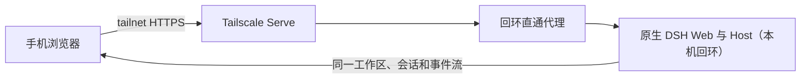

<p align="center">
  
</p>

<h1 align="center">dsh-mobile-tailscale</h1>

<p align="center">在手机上安全、实时地使用电脑中的 DeepSeek Harness。</p>

<p align="center">
  <a href="https://github.com/qiushenjie/dsh-mobile-tailscale"></a>
  <a href="LICENSE"></a>
</p>

<p align="center">
  <a href="#快速开始">快速开始</a> ·
  <a href="#使用">使用</a> ·
  <a href="#自定义">自定义</a> ·
  <a href="#配置">配置</a> ·
  <a href="#排障">排障</a> ·
  <a href="CHANGELOG.md">更新记录</a> ·
  <a href="README.en.md">English</a>
</p>

> 本插件是 [dsh-mobile](https://github.com/saya-ch/dsh-mobile) 的 fork，把 DeepSeek Harness 的手机端接到 **Tailscale Serve** 上：手机浏览器打开电脑节点的 MagicDNS 地址就能用，不装客户端、不改 DSH 源码。
>
> 访问控制就是 tailnet 成员身份——只有登录同一 tailnet 的设备能看到 `https://<node>.<tailnet>.ts.net`，证书由 Let's Encrypt 签发，因此没有配对、没有登录页、也没有证书警告。
>
> **0.4.0 起局域网通道已整体移除**：`:3443` 监听、配对链接与二维码、自签名 CA、`dsh-mobile setup` 都不再存在。原因见 [0.4.0 更新记录](CHANGELOG.md#040)。

## 快速开始

插件包名是 `dsh-mobile-tailscale`，可执行命令是 `dsh-mobile`。**没有初始化子命令**：装好后在面板里点开关即可。

**从本地源码安装**（本包尚未发布到 npm）

```bash
git clone https://github.com/qiushenjie/dsh-mobile-tailscale.git && cd dsh-mobile-tailscale
npm run build && npm pack                      # 需要 Node ^22.19.0 || >=24.0.0
dsh plugin --profile web add "$PWD/$(ls -1 dsh-mobile-tailscale-*.tgz | sort -V | tail -1)"
dsh --profile web
```

**发布到 npm 之后**可以换成：

```bash
dsh plugin --profile web add dsh-mobile-tailscale@latest
```

macOS 的 DSH Desktop 不会把 `dsh` 加进 PATH，改用内置 CLI：`node "/Applications/DSH Desktop.app/Contents/Resources/app/node_modules/@deepseek-ai/dsh/lib/bin.js" plugin --profile web add …`（路径里的版本号随 Desktop 升级变化）。

> - **覆盖安装同一版本不会生效**（pnpm 输出 `added 0`）：先 `rm -rf $DSH_HOME/profiles/<profile>/node_modules/dsh-mobile-tailscale` 再 `add`。
> - **主机端代码不热替换**：改完插件要完全退出并重新打开 DSH Desktop；客户端资源刷新页面即可。
> - 在 DSH 源码仓库里操作时，把 `dsh` 换成 `pnpm dsh`。

## 使用

1. 电脑和手机都安装 [Tailscale](https://tailscale.com/download)，登录**同一个 tailnet**，手机上保持运行。
2. 在 DSH 左下角打开 **移动访问** 面板，点 **启用远程访问**。
3. 面板显示 `https://<node>.<tailnet>.ts.net` 之后，在手机浏览器打开它——无需配对、无需登录。
4. 不用时点 **关闭远程访问**。

面板只有四样东西：远程地址（可复制）、开关、一行状态、**诊断**（跑一次脱敏自检）。远程开关/重连/重置只接受电脑本机调用，接口清单见 [排障手册 §15](TROUBLESHOOTING.md#15-桌面面板与管理接口)。


```mermaid
flowchart LR
  Phone["手机浏览器"] -->|"tailnet HTTPS"| Serve["Tailscale Serve"]
  Serve --> Proxy["回环直通代理"]
  Proxy --> DSH["原生 DSH Web 与 Host（本机回环）"]
  DSH -->|"同一工作区、会话和事件流"| Phone
```

## 自定义

在 DSH 对话里用 `/mobile <需求>`，agent 会直接改 `$DSH_HOME/mobile-access/` 下的文件，保存后手机端几秒内生效：界面与交互改 `mobile.css` / `mobile.js`；需要电脑能力时用 `extensions/`，其 `host.mjs` 以你的本机权限运行。

```text
/mobile 把手机端做成老式终端的样子，让消息像终端输出一样逐行滚动
/mobile 为手机端添加赛博朋克风格的监控面板，实时显示 CPU、内存和磁盘占用
```

手工建扩展脚手架：`dsh plugin --profile web exec dsh-mobile extension create <id> [--name <name>]`。

<p align="center">
  
  
  
  
</p>

> `host.mjs` 与本机程序同权限：只创建和运行你理解并信任的扩展。

## 配置

键写在 profile 的 `cordis.patch.yml` 的 `mobile-access` 条目里（或插件管理器的配置面板），除 `stateFile` 外都可省略。

| 键 | 默认值 | 说明 |
| --- | --- | --- |
| `mobileLayout` | `auto` | 手机布局策略：`auto` 只在本插件支持该布局代次时替换，`mobile` 强制替换，`stock` 从不替换。 |
| `upstreamOrigin` | `http://127.0.0.1:3080` | 回环上游；远程代理优先跟随 `DSH_WEB_URL`，再回退到这里。 |
| `stateFile` | 必填 | 插件状态文件。随包的 `cordis.patch.yml` 已设为 `$DSH_HOME/mobile-access/state.json`，扩展目录由它推导。 |
| `maxWebSockets` / `maxBodyBytes` / `upstreamTimeoutMs` | `16` / `160 MiB` / `30000` | 远程通道的并发 WebSocket 上限、请求体上限、上游超时。 |

`customCssFile`、`customScriptFile`、`mobileLayoutFile`、`mobileLayoutNextFile` 由插件自行维护，通常不用手写。运行时文件都在 `$DSH_HOME/mobile-access/`：`remote/control.json`（远程开关）、`remote/provider.json`（提供方）、`mobile.css` / `mobile.js`（自定义）、`extensions/`（扩展）。

## 手机端体验

手机端按触屏重排了会话抽屉、工具详情、设置、提问卡片和输入栏，并在远程通道上做了三件事：版本化资源长期缓存（不再每次导航重下约 5.66 MB）、会话首屏收窄到 10 条消息、剔除手机渲染不了的桌面模块。细节与实测数据见 [排障手册 §13/§14](TROUBLESHOOTING.md#13-手机端卡顿与长会话载入慢)。

## 排障

先看 [TROUBLESHOOTING.md](TROUBLESHOOTING.md)（含快速分诊）。最常见的三种：

- **面板显示「已就绪」但地址打不开**：确认 `tailscale status` 两侧都在线，点 **重新连接**，或按 [§4](TROUBLESHOOTING.md#4-远程通道显示-ready-但不可达) 重新注册 443。
- **手机打不开地址**：确认手机 Tailscale 正在运行、与电脑在同一 tailnet，且打开的是面板显示的那个地址。
- **健康检查**：`https://<node>.<tailnet>.ts.net/mobile-access/health` 返回 `{"ok":true}` 说明通道正常。

## 安全

- 访问控制完全由 **tailnet 成员身份**承担，请只把可信设备加入 tailnet。
- 不要开启 Tailscale Funnel，也不要把节点暴露到公网；不用时关闭远程开关。
- 插件不监听任何局域网端口，不保存配对密钥、设备凭据和自签名 CA；管理接口只接受电脑本机调用。

完整威胁模型见 [SECURITY.md](SECURITY.md)。

## 兼容性

`0.4.0` 已验证 `0.1.0-rc.5`、`0.1.0-rc.6`、`0.1.0-rc.7`、`0.1.1-rc.2`、`0.1.2-alpha.1`、`0.1.2-rc.1`、`0.1.7-rc.2`。未经验证的 DSH 版本只记录一条告警并继续启动；但较新的 DSH 会按 `peerDependencies` 在加载前拒绝整个插件，这种情况请升级插件，或为该精确版本组合显式授权豁免。历史对照表见 [排障手册 §19](TROUBLESHOOTING.md#19-诊断页与-dsh-版本兼容性)。

## 卸载

```bash
dsh plugin --profile web remove dsh-mobile-tailscale   # 只卸载插件
dsh plugin --profile web exec dsh-mobile purge --yes   # 连同 $DSH_HOME/mobile-access/ 一起清理
```

## 开发

```bash
npm ci && npm run verify   # 版本校验 + 类型检查 + 测试 + 构建 + 打包干跑
```

Apache-2.0，详见 [LICENSE](LICENSE)。
